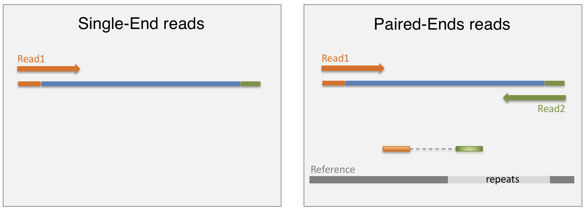
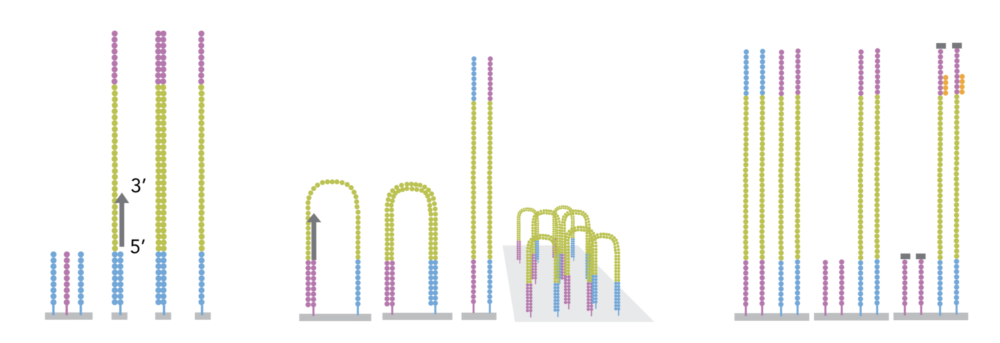
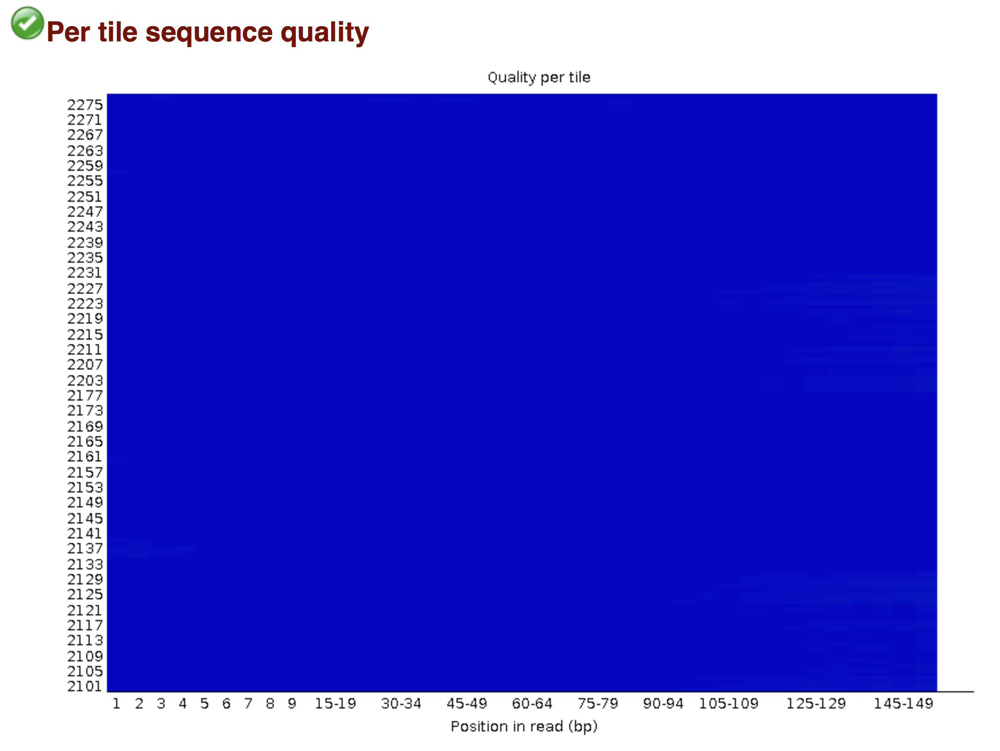
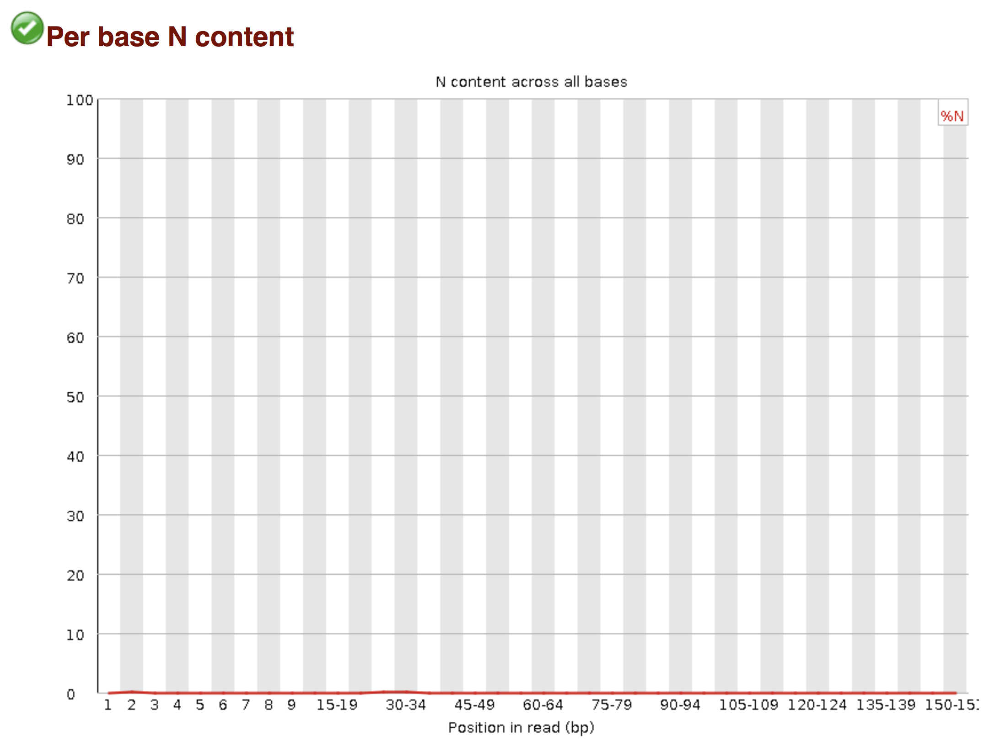
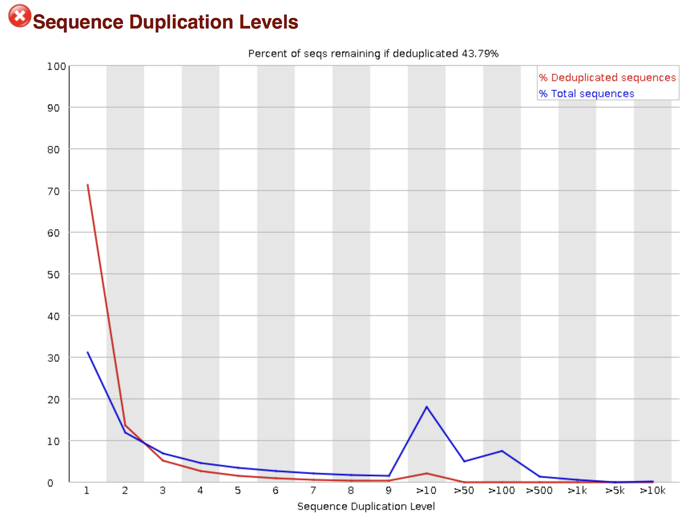
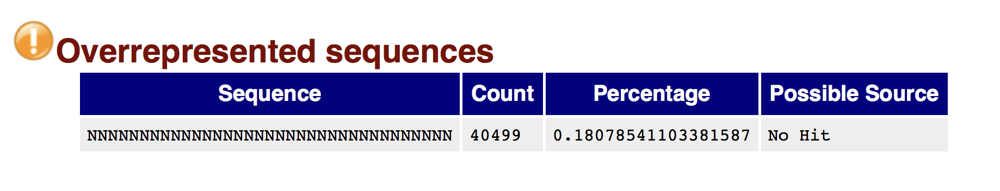
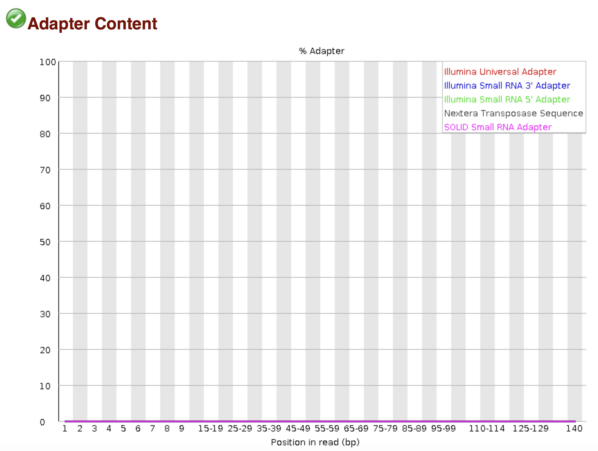
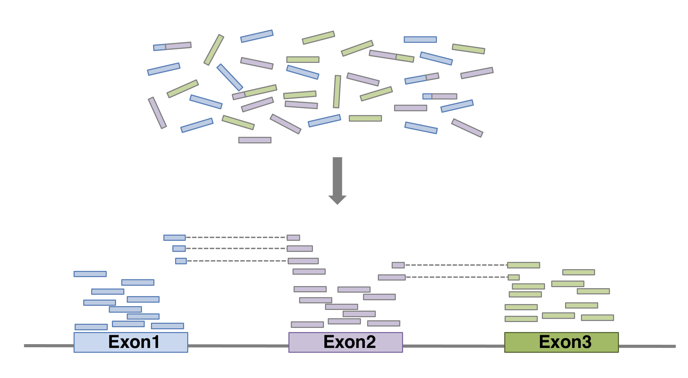
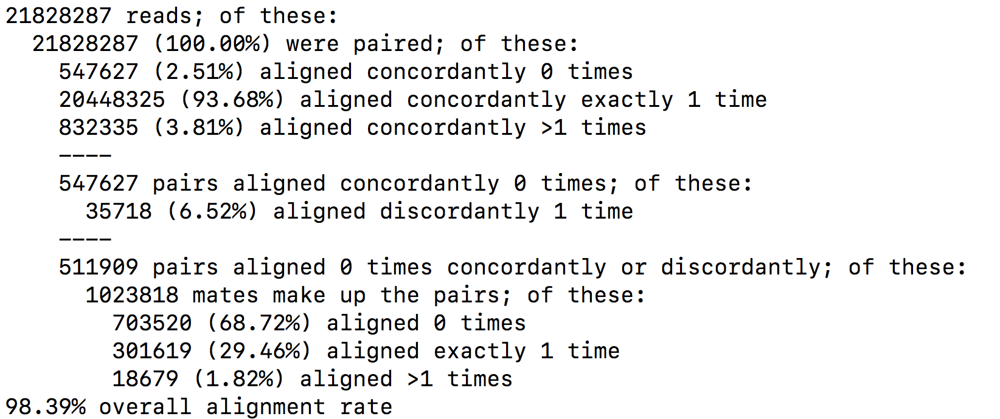
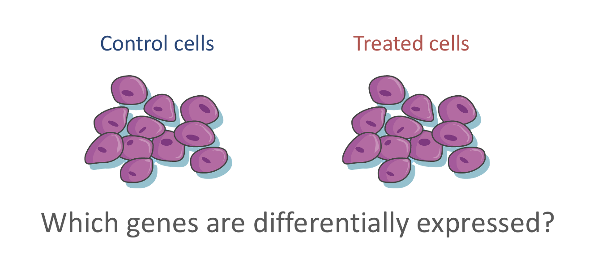

# High throughput sequencing {#sec:hts}

```{r, echo = F}
suppressPackageStartupMessages(library("tidyverse"))
library(tidyverse)
library(DT)
```


**Learning Objectives**

The aim of this chapter is to present high throughput sequencing by
going through one of its key applications: RNAseq. It is a highly
sensitive and accurate tool that has revolutionised the study of
transcriptomes. The objective is to give an overview of the
technology.

We will pass through the different steps starting from the library
preparation and the sequencing process. We will explore the resulting
fastq files and the downstream processing pipeline including quality
control, alignment and counting steps.

## RNA-seq library preparation

The starting point of a RNAseq experiment is the cDNA library
preparation.  RNA is first isolated from cells and purified to remove
ribosomal RNA which constitute the majority of total RNA. This can be
done by extracting poly(A) RNA or by depleting rRNA. In a classical
RNA-seq library preparation, purified RNA is then fragmented, reverse
transcribed and adapters are ligated to both extremities to allow for
amplification.

While simple, this approach loses the information about which DNA
strand corresponds to the sense strand of RNA. This can be avoided by
using a stranded protocol. In this case, dUTP are added during the 2nd
strand cDNA synthesis and the newly synthetized cDNA strand is
degradated after the ligation step. This allows to infer the
transcript orientation as only the first cDNA strand is
sequenced. Strand-specificity leads to lower number of ambiguous reads
(overlapping multiple genes).

```{r, echo=FALSE, fig.align='center', out.width='100%'}
knitr::include_graphics("figs/library.png")
```

## Sequencing

Once the library is ready, molecules from the library are sequenced in
a high throughput manner to obtain short sequences from one end
(single-end sequencing) or both ends (pair-end sequencing). Single-end
sequencing is cheaper, but Paired-end sequencing improves the ability
to localise the fragment in the genome and resolve mapping close to
repeat regions, resulting in less multimapping reads.

```{r, echo = FALSE, fig.align ='center', out.width = '100%'}

```

The sequencing is done by a cluster amplification process.

The library preparation is hybridized to a flow cell coated with
immobilized oligonucleotides that serve as support to hold the DNA
strands in place during sequencing. The templates are copied from the
hybridized primers by 3’ extension using a high-fidelity DNA
polymerase. The original templates are denatured, leaving the copies
immobilized on the flow cell surface.

Immobilized DNA template copies are then amplified by bridge
amplification. The templates loop over to hybridize to adjacent
oligonucleotides. DNA polymerase copies the templates from the
hybridized oligonucleotides, forming dsDNA bridges, which are
denatured to form two ssDNA strands. These two strands loop over and
hybridize to adjacent oligonucleotides and are extended again to form
two new dsDNA loops.  The process is repeated on each template by
cycles of denaturation and amplification to create millions of
individual, dense clonal clusters containing ~2,000 molecules.

Each cluster of dsDNA bridges is denatured, and the reverse strand is
removed by specific base cleavage, leaving the forward DNA strand. The
3’-ends of the DNA strands and flow cell-bound oligonucleotides are
blocked to prevent interference with the sequencing reaction. The
sequencing primer is hybridised to the Illumina adapter. Clusters are
ready for sequencing.


```{r, echo = FALSE, fig.align ='center', out.width = '100%'}

```

The sequencing process is done by synthesis.  A polymerase adds a
fluorescently tagged dNTP to the DNA strand (only one base is able to
be added per round due to the fluorophore acting as a blocking group,
but the blocking group is reversible). Each of the four bases has a
unique fluorophore, and after each round, the machine records which
base was added. The fluorophore is then washed away and the process is
repeated.

For a dynamic view of the cluster amplification process, watch the
[Illumina video](https://www.youtube.com/watch?v=fCd6B5HRaZ8).

## fastq files

The sequence data generated from the sequencer are received in text
files called fastq files.  For a single-end run, one fastq file is
created for each sample. For a paired-end run, two separated fastq
files are generated, each containing sequences from one end.

What does a FASTQ file look like?

```{bash}
head wsbim2122_data/RNAseq_pipeline/example.fastq
```

Each entry in a fastq file consists of 4 lines:

- A sequence identifier (by convention preceded by '@') with
  information about the sequencing run
- The sequence
- The same sequence identifier preceded by '+'
- The base call quality scores. These are Phred scores, encoded using
  [ASCII characters](https://theasciicode.com.ar) to represent the
  numerical quality scores.  Each character is assigned a quality
  score between 0 and 40. Quality scores represent the probability
  that the corresponding nucleotide call is incorrect.

```{r, echo=FALSE, fig.align='center', out.width='100%'}
knitr::include_graphics("figs/phred_score.png")
```

`r msmbstyle::question_begin()`

What do you think of the quality of the two sequences presented in the
fastq file above?

`r msmbstyle::question_end()`

## Processing pipeline

The raw reads from fastq files will need to pass through a different
tools to yield ultimately a count table, representing a snapshot of
individual gene expression levels.  The execution of this set of tools
in a specified order is commonly referred to as a pipeline.


```{r, echo=FALSE, fig.align='center', out.width='40%'}
knitr::include_graphics("figs/pipeline.png")
```

### Quality control

Of course, no one will analyse the sequences from the fastq file one
by one to check their quality... Rather, a software called
[FastQC](http://www.bioinformatics.babraham.ac.uk/projects/fastqc/)
can be used. Then, another program such as
[Trimmomatics](http://www.usadellab.org/cms/?page=trimmomatic) can
help to clean the reads.

- **FastQC**

[FastQC](http://www.bioinformatics.babraham.ac.uk/projects/fastqc/)
allows to analyse different features of the reads and generates a
report that includes several diagnostic plots to highlight any problem
the data may have.

FastQC is run from the command line:

```{r, eval = FALSE}
$ fastqc SampleName.fastq
```

`r msmbstyle::question_begin()`

Try to interpret the different plots of this
[fastQC report](./OD01_10_1_fastqc.html)
from a real RNAseq fastq file.

Another report corresponding to [bad
quality](https://www.bioinformatics.babraham.ac.uk/projects/fastqc/bad_sequence_fastqc.html)
data can be used as a point of comparison.

`r msmbstyle::question_end()`


`r msmbstyle::solution_begin()`

**1. Per base sequence quality**

```{r, echo=FALSE, fig.align='center', out.width='80%'}
knitr::include_graphics("figs/fastqc_fig1.png")
```

This graph shows an overview of the range of quality values (Phred
scores) across all bases at each position. In this example, the sample
contains reads that are 150 bp long.  For each position, a boxplot is
drawn with the median value, represented by the red line. The mean
quality is represented by the blue line. The background of the graph
divides the y-axis into very good quality scores (green), scores of
reasonable quality (orange), and reads of poor quality (red).  Here
the quality of reads is very good.

**2. Per tile sequence quality**:

```{r, echo=FALSE, fig.align='center', out.width='80%'}

```

Flowcells are divided into tiles. The graph allows to look at the
quality scores from each tile across the reads to see if there is a
loss in quality associated with one part of the flowcell. The plot
shows the deviation from the average quality for each tile. Cold
colours being positions where the quality was at or above the average
for that base in the run, and hotter colours indicate that a tile had
worse qualities than other tiles for that base.  Low scores are often
found around the edges, but hot spots can also occur in the middle
(due to an air bubble for example), however these should represent
only a small percentage of the total sequences.  In this example no
tile shows poor quality.


**3. Per sequence quality scores**

```{r, echo=FALSE, fig.align='center', out.width='80%'}
knitr::include_graphics("figs/fastqc_fig3.png")
```

It represents a density plot of average quality per read.  The
distribution of average read quality should show a tight peak in the
upper range of the plot.  It could report a subset of sequences with
low quality values, however these should represent only a small
percentage of the total sequences.

**4. Per base sequence content**

```{r, echo=FALSE, fig.align='center', out.width='80%'}
knitr::include_graphics("figs/fastqc_fig4.png")
```

It plots the proportion of each base position over all the
reads. Typically, we expect to see each base roughly 25% of the time
at each position so the lines in this plot should run parallel with
each other. Experience has shown that RNAseq libraries often have a
selection bias in around the first 12bp of each run. This is due to a
biased selection of random primers, but doesn't represent any
individually biased sequences.  This is a typical plot obtained for
RNAseq reads.

**5. Per sequence GC content**

```{r, echo=FALSE, fig.align='center', out.width='80%'}
knitr::include_graphics("figs/fastqc_fig5.png")
```

It represents a density plot of average GC content in each of the
reads.  This plot makes sense for whole genome shotgun sequencing, as
the overall GC content should reflect the GC content of the underlying
genome. A GC bias could indicate an overrepresented sequence
contaminating the library.  For RNA sequencing, this plot makes less
sense, as there may be a greater or lesser distribution of mean GC
content among transcripts causing the observed plot to be wider or
narrower than an ideal normal distribution.

**6. Per base N content**

```{r, echo=FALSE, fig.align='center', out.width='80%'}

```

If a sequencer is unable to make a base call with sufficient
confidence then it will replace the conventional base call with an
'N'. This graph plots the percent of times that ‘N’ occurs at a
position in all reads. If there was an increase at a particular
position, it could indicate that something went wrong during
sequencing.

**7. Sequence Length Distribution**

```{r, echo=FALSE, fig.align='center', out.width='80%'}
knitr::include_graphics("figs/fastqc_fig7.png")
```

The distribution of sequence lengths of all reads in the file.
Here we see that most reads are 150 pb long but some reads are shorter.

**8. Sequence Duplication Levels**:

```{r, echo=FALSE, fig.align='center', out.width='80%'}

```

It gives the distribution of duplicated sequences.  The blue line
corresponds to the percentage of duplicated reads among total number
of reads.  The red line corresponds to the percentage of duplicated
reads among total number of distinct reads.

In a highly diverse library from whole genome shotgun sequencing, it
is expected that nearly all reads will be unique, appearing only 1
time in the sequence data.  A high level of duplication could indicate
biased PCR enrichment, or presence of contaminant.

In contrast, in RNAseq, there will likely be some very highly abundant
transcripts for which it is expected to observe duplicated reads. Here
the data was flagged as 'failed' by FastQC even though duplication was
expected in this case.

**9. Overrepresented sequences**

```{r, echo=FALSE, fig.align='center', out.width='80%'}

```

FastQC lists here all of the sequence which make up more than 0.1% of
the total. Finding that a single sequence is highly overrepresented in
the set means that it is either highly biologically significant, or
that the library is biased or contaminated.  Here it is of course not
relevant as it just corresponds to a sequence full of 'N'.

**10. Adapter Content**

```{r, echo=FALSE, fig.align='center', out.width='80%'}

```

This graph indicates if and where adapter sequences occur in the reads.

`r msmbstyle::solution_end()`

- **Trimmomatics**

FastQC gives a global vision the quality of the sample. If it is not
optimal, it is advisable to use
[Trimmomatics](http://www.usadellab.org/cms/?page=trimmomatic)
software to filter poor quality reads and trim residual adapters.

Trimmomatics has a variety of options to clean the reads. Read the
[manual](http://www.usadellab.org/cms/uploads/supplementary/Trimmomatic/TrimmomaticManual_V0.32.pdf)
for more information. However, a command for Trimmomatics could look
something like the command below.  In this case it would perform
adapter removal, and perform a scan of the read with a 10-base wide
sliding window, cutting when the average quality per base drops below
20.

```
$ java -jar trimmomatic-0.38.jar \
  PE \                                  # paired-end
  -threads 4 \                          # number of threads
  SampleName_1.fastq \                  # fastq file for fw reads
  SampleName_2.fastq  \                 # fastq file for rev reads
  SampleName_1_clean.fastq \            # clean fastq for fw reads
  SampleName_1_unpaired.fastq \         # fastq for discared fw reads
  SampleName_2_clean.fastq \            # clean fastq for rev reads
  SampleName_2_unpaired.fastq \         # fastq for discared rev reads
  ILLUMINACLIP:TruSeq3-PE.fa:2:30:10 \  # cut adapter from the read.
  SLIDINGWINDOW:10:20                   # sliding window trimming
```

`r msmbstyle::question_begin()`

How could you check that the trimming performed well?

`r msmbstyle::question_end()`

`r msmbstyle::solution_begin()`

Once samples passed through Trimmomatics, they should perform better
on the quality tests run by FastQC. You could re-run FastQC on your
clean fastq files to see whether adapters were correctly removed and
if the per base sequence quality is higher after trimming...

```
$ fastqc SampleName_1_clean.fastq
```

`r msmbstyle::solution_end()`

## Alignment

Next step is to map the reads to determine where in the genome the
reads originated from.  Many different aligners are available such as
[HISAT2](https://ccb.jhu.edu/software/hisat2/manual.shtml),
[STAR](https://github.com/alexdobin/STAR),
[BWA](http://bio-bwa.sourceforge.net),
[Salmon](https://combine-lab.github.io/salmon/),
[Subread](https://sourceforge.net/projects/subread/)...  There is no
gold standard, but some tools are better suited for particular NGS
analyses [@Baruzzo:2017]... In the case of RNAseq, it is important to
use an aligner able to handle spliced reads.

```{r, echo = FALSE, fig.align = 'center', out.width = '100%', purl = TRUE}

```


Here we show an example of what the command could look like when using
[HISAT2](http://daehwankimlab.github.io/hisat2/) aligner,
launched with default parameters.  In this basic configuration,
mandatory parameters are of course the fastq file(s) and the sequence
of the genome on which the reads have to be aligned. In practical, the
genome's sequence is not given as it is but in an indexed form
[^Indexed_genome]. Of course many of other parameters can be fine
tuned (see the
[manual](http://daehwankimlab.github.io/hisat2/manual/) for more
details).  The alignment output file data is a `sam` file (see below).

[^Indexed_genome]: Genome indexing allows the aligner to quickly find
potential alignment sites for query sequences in a genome, which saves
considerable time during alignment. Frequently used genome (human,
mouse, rat...) already have indexed versions that can be downloaded
directly. When working with another reference genome, a specific
indexed genome has to be built.


```
$ hisat2 \
  -p 6 \                        # number of threads
  -x genome_index \             # index for the reference genome
  -1 SampleName_1_clean.fastq \ # clean fastq_file for fw reads
  -2 SampleName_2_clean.fastq \ # clean fastq_file for rev reads
  -S SampleName.sam             # sam file name
```

It is recommended to pay attention to the HISAT2 report to check the
alignment rate.  For a PE-end alignment it could look like this:

```{r, echo = FALSE, fig.align = 'center', out.width = '100%', purl = TRUE}

```

**SAM format**

The [SAM](https://genome.sph.umich.edu/wiki/SAM) file, is a
tab-delimited text file.  Each line corresponds to alignment
information for a single read. Each line has 11 mandatories fields for
essential mapping information and a variable number of other fields
for aligner specific information. An example of few entries from a SAM
file is displayed below.

```{bash}
head wsbim2122_data/RNAseq_pipeline/example.sam
```

Field 1: Sequence ID

Field 2: [SAM Flag](https://broadinstitute.github.io/picard/explain-flags.html). It gives information about
the read (is it paired, aligned, is the mate read properly aligned...)

Field 3: Chromosome where alignment occurs

Field 4: Position of alignment

Field 5: Mapping quality score (read uniquely mapped (60), multiply mapped (1) or unmapped (0))

Field 6: [CIGAR](https://sites.google.com/site/bioinformaticsremarks/bioinfo/sam-bam-format/what-is-a-cigar)
string. It is a representation of alignment indicating positions of match/mismatch/deletion/insertion
compared to the reference.

Field 7: Reference name of the mate (Set to '=' if the mate’s reference sequence is the same as this alignment’s)

Field 8: Position of mate

Field 9: Inferred fragment length

Field 10: Read sequence (reverse-complemented if aligned to the reverse strand)

Field 11: Base quality (Phred score)

Field 12: Optional. See [hisat2 manual](http://daehwankimlab.github.io/hisat2/manual/) for more information.

**BAM format**

BAM file is a compressed binary version of SAM file.  SAM files can be
easily converted into BAM files using [samtools](http://www.htslib.org
software), and it is sometimes mandatory to sort the SAM/BAM by
chromosomal coordinates for downstream applications.

```{r, eval = F}
samtools view -Sb XXX.sam | samtools sort > XXX.bam
```

## Counting

Now comes the quantification step. It can be performed with several
tools such as [htseq-count](https://pypi.org/project/HTSeq/) or
[FeatureCounts](http://bioinf.wehi.edu.au/featureCounts/).  We will
describe the latter as it runs much faster. It was developed for
counting reads to genomic features such as genes, exons, promoters and
genomic bins.  FeatureCounts takes as input SAM/BAM files and an
annotation file (such as a gtf file) containing chromosomal
coordinates of features.

The Gene Transfer Format (GTF) is a widely used format for storing
gene annotations.  Human and mouse GTF files can be downloaded easily
from [Ensembl](http://www.ensembl.org/info/data/ftp/index.html) or
from the [UCSC table
browser](https://www.gencodegenes.org/human/). The first few lines of
gtf annotation file for human genome assembly GRCh38 look like this:

```{bash}
head -n 20 wsbim2122_data/RNAseq_pipeline/Homo_sapiens.GRCh38.94.gtf
```

FeatureCounts will count the number of uniquely mapped reads assigned
to features (e.g. an exon) or meta-features (e.g. a gene) of the gtf
file. When summarizing reads at gene level, read counts obtained for
exons belonging to the same gene will be added up to yield the read
count for the corresponding gene.  Note that an exon-spanning read
will be counted only once for the corresponding gene even if it
overlaps with more than one exon.

```{r, echo = FALSE, fig.align = 'center', out.width = '100%', purl = TRUE}
knitr::include_graphics("figs/featurecount_metafeature.png")
```

FeatureCounts could be launched with the following command.  As usual,
many of other parameters can be fine-tuned (see the
[manual](http://manpages.ubuntu.com/manpages/bionic/man1/featureCounts.1.html)
for more details).

```
featureCounts \
-p \                  # paired (fragments counted  instead  of  reads)
-a annotations.gtf \  # name of the annotation file
-t exon \             # feature type in GTF annotation
-g gene_id \          # Meta-features used in GTF annotation
-s 0 \                # strand-specificity
-o counts.tsv \       # Name of the output file
mapping_results.bam
```

Here is an example of featurecounts output file. The last column gives
the raw counts of each gene in that sample.

```{r}
counts_result <- read_tsv(file = "wsbim2122_data/RNAseq_pipeline/OD01_10_featurecounts.tsv.gz", skip = 1)
datatable(head(counts_result))
```

`r msmbstyle::question_begin()`

Inspect the count table.

1. How many genes are tested ?

2. How many reads were assigned to genes?

3. Inspect the counts. What is the maximum value? How many genes have zero counts ?

4. Plot the distribution of counts. How does it look like?

`r msmbstyle::question_end()`


`r msmbstyle::solution_begin()`

Inspect the count table.

1. How many genes are tested ?

```{r}
nrow(counts_result)
```
2. How many reads were assigned to genes?

```{r}
sum(counts_result$OD01_10.bam)
```

3. Inspect the counts. What is the maximum value? How many genes have zero counts ?

```{r}
summary(counts_result$OD01_10.bam)

counts_result %>%
  filter(OD01_10.bam == 0) %>%
  nrow()
```


4. Plot the distribution of counts. How does it look like?

```{r}
counts_result %>%
  rename(counts = OD01_10.bam) %>%
  ggplot(aes(x = log2(counts + 1))) +
  geom_histogram(bins = 20)
```

Note that a "pseudo-count" was added before the log2 transformation of the counts,
to avoid elimination of counts equal to zero.

`r msmbstyle::solution_end()`

## Differential expression analysis

The aim of an RNAseq experiment is often to compare different types of
cells, or to compare treated cells to control cells, to see if some
genes are up- or down- regulated.

```{r, echo = FALSE, fig.align = 'center', out.width = '100%', purl = TRUE}

```

Once fastq files from each sample have been processed into raw counts,
results can be merged in a single count matrix, were each column gives
the counts evaluated for each gene in each sample. This is the
starting point of a differential expression analysis.  As it addresses
relatively complex statistical concepts, it will be covered in the
next chapter.
