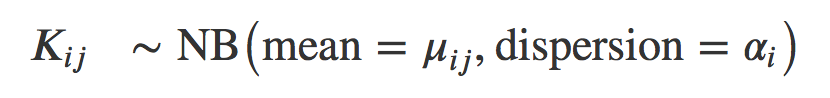

# Differential expression analysis {#sec:rnaseq}

**Learning Objectives**

The goal of this chapter is

- to understand the different theorical concepts behind a differential expression analysis 

- to provide a real-life example of DE analysis analysis running DESeq2 step-by-step


## Theory behind DESeq2

DESeq2 is bioconductor package widely used for differential expression analysis.
For more information read the original paper [@Huber:2014] and the [DESeq2 vignette](https://bioconductor.org/packages/release/bioc/vignettes/DESeq2/inst/doc/DESeq2.html).

The starting point of the analysis is a count matrix, and the goal is to identify 
genes that are differentially expressed between samples.

The different steps of the analysis are illustrated in the figure below. Briefly, 
DESeq2 starts by normalising the raw counts. Then, it estimates the gene-wise 
dispersions and shrinks these estimates to generate more accurate estimates of dispersion 
to model the counts. Finally, DESeq2 fits a negative binomial model and performs 
hypothesis testing using the Wald test.


```{r, echo=FALSE, fig.align='center', out.width='60%', purl=TRUE}
knitr::include_graphics("figs/deseq2_steps.png")
```


### Normalisation

- **Why is it mandatory to normalise?**

Observed counts are supposed to reflect gene abundance (what we are 
interested in), however they are also dependent on other less interesting 
factors such as gene length, sequencing biases, sequencing depth or library 
composition. Normalisation is the process of scaling raw count values to 
account for the “uninteresting” factors rendering the expression levels more 
comparable between and/or within samples. 

- **Gene length**

As illustrated in the example below, gene 1 and gene 2 have similar levels of expression, 
but many more reads map to gene 2 than to gene 1. This might not be related to biology 
but it can just reflect the fact that gene 2 is longer. Gene length normalisation is 
mandatory when the purpose is to compare expression levels between different genes within 
the same sample. However, for differential expression analysis, as genes expression 
levels are compared between samples, gene length normalisation is not necessary (and 
even not recommended). It was just mentioned here for information because many RNAseq common 
normalisation methods such as TPM (transcript per million), FPKM (fragment per million), 
or RPKM (reads per million) do normalise read counts by gene length. 

```{r, echo=FALSE, fig.align='center', out.width='100%', purl=TRUE}
knitr::include_graphics("figs/read_length.png")
```


- **Sequencing depth**

Each sequencing experiment will produce a certain number of reads expected to be 
typically around tens of millions. A fraction of the raw sequencing reads will be 
discarded during the quality control, the alignment and the counting processes, 
which implies that the total number of reads for each sample will be different.

As shown in the following example, all genes seem to be expressed at higher levels in 
sample 1 than in sample 2, but this is likely because sample 1 has twice more reads than 
sample 2. Accounting for sequencing depth is necessary for differential expression analysis 
as samples are compared with each other.

```{r, echo=FALSE, fig.align='center', out.width='100%', purl=TRUE}
knitr::include_graphics("figs/Sequencing_depth.png")
```

- **Library composition**

The library composition might also be different in samples. To illustrate this, 
let's imagine a basic cell expressing only 2 genes (genes A and B) and assume that 
a drug treatment induces a strong expression of gene C. If the normalisation was done 
using total number of reads only, then the counts of gene A would be divided by 4 in 
control cells, while it would be divided by 12 in treated cells. This would lead to the 
misleading conclusion that the treatment has reduced 3 times the expression of gene A. 
In this case, the library composition has changed but not the expression level of gene A.


```{r, echo=FALSE, fig.align='center', out.width='100%', purl=TRUE}
knitr::include_graphics("figs/library_composition.png")
```

In a real dataset, a few highly differentially expressed genes, differences in the number 
of genes expressed between samples, or presence of contaminations can skew library composition.
Accounting for it is highly recommended for accurate comparison of expression between samples [@Anders:2010].

- **DESeq2 normalisation method**

DESeq2 will use a normalisation method that takes into account both library size 
and library composition. To normalise for sequencing depth and RNA composition, DESeq2 
uses the median of ratios method.

Step 1: DESeq2 creates a pseudo-reference sample (row-wise geometric mean).
It calculates the geometric mean of each gene. Geometric mean is used instead of 
classical mean because it uses log values. It is hence more robust as it is less influenced 
by extreme values. The geometric means constitute a pseudo-reference sample.

Step 2: For every gene in a sample, the ratios (sample/pseudo-reference sample) are calculated. 
Since the majority of genes are not differentially expressed, the majority of genes in 
each sample should have similar ratios within the sample.

Step 3: The median value of all ratios for a given sample is taken as the size factor for that 
sample. Importantly, the method is based on the assumption that the majority of genes are 
not differentially expressed, which implies that rare genes that are really up-regulated / 
down-regulated should not influence the median. Furthermore, the median is calculated skipping 
genes with a geometric mean of zero. This will hence automatically eliminate genes expressed 
in some samples but not in others and will help to focus the scaling factor on housekeeping genes. 

Step 4: DESeq2 calculates the normalised counts using the scaling factor
This is performed by dividing each raw count values in a given sample by that sample’s 
scaling factor. 

```{r, echo=FALSE, fig.align='center', out.width='100%', purl=TRUE}
knitr::include_graphics("figs/SF_steps.png")
```


### Count modeling

Let's first have a look at the counts distribution for a typical RNAseq sample:

```{r, echo=FALSE, fig.align='center', out.width='80%', purl=TRUE}
knitr::include_graphics("figs/distribution_of_counts.png")
```

It is obvious that the count data is not normally distributed. Counts are integer values, 
always positive, and we observe a large number of genes with low counts (or counts about zero), 
and a few number of genes with a very high count level. 

As seen in the [WSBIM1322 course](http://bit.ly/WSBIM1322) with the example of the coin toss, 
count data are often modelised by a binomial distribution with parameters n and p where p is the 
discrete probability distribution of the number of successes in a sequence of n 
independent experiments. In an RNAseq experiment, p would be the probability of getting 
a read associated to a particular gene given that n total number of reads were sequenced 
in the experiment. However, when n is large and p is low, Poisson distribution is used 
instead of binomial. It describes typically the distribution of a rare event in a large 
population, which fits better to RNAseq. Indeed, for each sample, the total number of reads 
tends to be in millions, while the counts per gene can vary considerably but tend to be 
in tens, hundreds or thousands. Therefore, the chance of a given read to be mapped to any 
specific gene is extremely small. 

The Poisson distribution has only one parameter indicating its expected mean. 
Its variance and all other properties follow from it. In particular, one key assumption 
of the Poisson distribution is that the variance equals the mean. Applying a Poisson 
distribution to Rnaseq counts holds true when comparing technical replicates from a same 
sample, where the variance only reflects the counting noise. But when comparing biological 
replicates, counting noise is not the only source of variance. The observed count values for 
each gene within biological replicates fluctuate more importantly, due to the combination of 
biological and technical factors: inter-individual variations in gene expression, sample purity, 
cell reponses to environment (e.g. heat-shock)... Due to this overdispersion, the Poisson 
distribution doesn't fit that well to RNAseq counts.

Actually, RNAseq counts are better modelised by an alternative distribution, 
the negative-binomial. It is derived from the Poisson distribution but the 
negative-binomial distribution has, in addition to the mean parameter, 
an extra parameter $α$ called the “dispersion” parameter to model this “extra” 
variance that is empirically observed in RNA-Seq experiments. 


```{r, echo=FALSE, fig.align='center', out.width='100%', purl=TRUE}

```


### Dispersion estimation

Having modelised counts by a negative-binomial distribution, next step is to estimate, 
for each gene, the two parameters of the distribution (mean and dispersion). The mean 
will be estimated easily from the observed normalised counts in both conditions, but 
the dispersion is not that trivial to estimate.

Dispersion is a measure of spread or variability in the data ($α= CV^2$). A gene with 
a dispersion value of 0.04 means 20% variation around the expected mean. Estimate the 
dispersion for each gene would be quite straightforward if we had for each condition, 
hundreds of replicates. Of course, this is not feasible for economic reasons, and 
experiments are usually done on only 3-5 replicates. But how to estimate dispersion 
reliably based on such a little number of samples? To overcome this problem, DESeq2 
makes the assumption that genes of similar expression levels have similar dispersions 
and it will use information coming from other genes expressed at similar level. 

**Step1: Dispersion for each gene is estimated separately.**
An initial estimation of dispersion for each gene is first estimated using maximum 
likelihood estimation. In other words, given the count values of the replicates, the 
most likely estimate of dispersion is calculated. For each gene, the dispersion estimate 
is plotted in function of the mean expression level (mean counts of replicates). 
This produce the so-called "dispersion plot" where each gene is represented by a black dot. 

```{r, echo=FALSE, fig.align='center', out.width='80%', purl=TRUE}
knitr::include_graphics("figs/dispersion_plot.png")
```

Note that the dispersion plot highlights an intrinsic feature of RNAseq data: 
genes with low read counts show substantially higher dispersion than highly expressed genes. 

**Step 2: A curve is fitted to gene-wise dispersion estimates**.
A curve is fitted (displayed as a red line in the dispersion plot), which represents the 
estimate for the expected dispersion value for genes of a given expression strength. 
The idea behind fitting a curve to the data is that different genes will have different 
scales of biological variability, but, over all genes, there will be a distribution of 
reasonable estimates of dispersion.

**Step 3: Shrinkage of gene-wise dispersion estimates toward the values predicted by the curve**.
Initial gene-wise dispersion estimates will be shrinked (by an empirical Bayes approach) 
towards this fitted curve to obtain the final dispersion estimates. The adjusted dispersion 
values are represented by the blue dots in the dispersion plot. For a certain number of genes, 
the adjusted dispersion will be significantly increased and this will limit the number of 
false-positive that could arise from an underestimated dispersion. Dispersion estimates 
that are slightly above the curve are also shrunk toward the curve. However, genes with 
extremely high dispersion[^outlierSD] values are not. In fact DESeq2 assumes that these 
genes might not follow the modeling assumptions and could have higher variability than others 
for biological or technical reasons. For these genes, shrinking the values toward the curve 
could result in false positives. These genes are shown surrounded by blue circles in the 
dispersion plot.

[^outlierSD]: genes with extremely high dispersion are those for which the adjusted 
dispersion is more than 2 residual standard deviations above the curve.

This shrinkage method is particularly important to reduce false positives in the 
differential expression analysis. The shrunken dispersion values will be used for 
fitting of the model and differential expression testing.

```{r, echo=FALSE, fig.align='center', out.width='80%', purl=TRUE}
knitr::include_graphics("figs/disp_shrinkage.png")
```


### GLM

Adapt this paragraph in function of Laurent's chapter on linear models.

DESeq2 fits a generalized linear model of the form: $log2(qij)=xj.βi$, and $βi$ 
coefficients are computed. They give estimates of the log fold changes for gene i 
for each column of the model matrix. Standard errors for the log2 fold changes are 
also estimated.

### Statistical test

#### Wald test

The ultimate goal of a test for differential expression is to decide whether, 
for a given gene, an observed difference in read counts is significant, that is, 
whether it is greater than what would be expected just due to natural random variation. 
The null hypothesis $H_0$ is that there is no differential expression across two sample groups, 
which is the same as saying that the log2foldchange = 0. A statistical test, the Wald test, 
will determine whether the data provides sufficient evidence to conclude that this value 
is really different from zero. 

For the Wald test, the log2foldchange is divided by its standard error, resulting 
in a z-statistic. The z-statistic is compared to a standard normal distribution, 
and a p-value is computed reporting the probability that a z-statistic at least 
as extreme as the observed value would be selected at random. In principle, if this 
p-value is small (below a certain cutoff) the null hypothesis is rejected.

#### Multiple testing correction


- **False discovery rate (FDR)**

Recall that a pvalue of 0.05 means that there is only 5% chance of getting this data 
if no real difference existed (if $H_0$ was really true). In other words, choosing a cut 
off of 0.05 means there is 5% chance that the wrong decision is made (resulting in a 
false positive). But remember the problematic of multiple testing seen in chapter 7 
from [WSBIM1322 course](http://bit.ly/WSBIM1322).

In a typical RNAseq differential expression analysis, we might have about 20,000 genes 
to test and usually only a fraction of genes is really differentially expressed. 
Imagine a drug treatment that modifies the expression of about 1000 genes, but that has 
no impact on the other ones. The first histogram shows how the distribution of pvalues 
for truly modified genes ($H_0$ is false) would look like: most of the pvalues would be 
very small. Using a pvalue cutoff of 0.05 should permit to identify most of these 
differentially expressed genes. The second histogram shows the distribution of pvalues 
for unmodified genes ($H_0$ is true). Here the p-values are uniformly distributed between
0 and 1, and we can see that 5% of these genes appear to be significant even though this 
is only by chance as the drug had no real effect on them. But 5% of 19000 genes means ... 
950 false positive genes! Hence, pvalues obtained from the Wald test must be corrected 
for multiple testing to avoid excess false positives.

By default DESeq2 uses Benjamini-Hochberg method to adjust pvalues.
The third histogram bellow illustrates the principle behind this False discovery rate (FDR) 
adjustment. As differential expression analysis is done on the whole set of genes, the 
resulting pvalues will have a distribution corresponding to the combination of both histograms. 
Most of the p-values are uniformly distributed between 0 and 1 but there is a spike to the 
left close to zero, due to those p-values for which $H_0$ is false. The correction approach 
helps to estimate how many of the significant values are actually false positives. 
It tries to find the height where the p-value distribution flattens out (corresponding to 
the red line) and incorporates this height value into the calculation of FDR adjusted p-values. 
Choosing a cut off of 0.05 for padjusted values now implies that 5% of significant tests 
(but not 5% of all tests as before) will result in false positives.

```{r, echo=FALSE, fig.align='center', out.width='100%', purl=TRUE}
knitr::include_graphics("figs/pval_histograms.png")
```


- **Independentfiltering**

Multiple testing adjustment tends to be associated with a loss of power. 
To counteract this effect, one possibility is to filter out those tests from 
the procedure that have no, or little chance of showing significant evidence, 
without even looking at their test statistic. Genes with very low counts are 
typically not likely to be significant due to high dispersion. However, these 
genes have an influence on the multiple testing adjustment, whose performance 
improves if such genes are removed. By removing the weakly-expressed genes from 
the input to the FDR procedure, more significant genes can be found among those 
that are kept, and this improves the power of the test. This approach is known 
as independent filtering.

DESeq2 uses as filtering criterion the mean of normalised counts. Genes with a 
mean expression value under a certain threshold are removed. Such filtering is 
permissible only if the filter criterion is independent of the actual test statistic, 
otherwise, the filtering would invalidate the test and consequently the assumptions 
of the FDR procedure. This is why filtering is done on the average expression over 
all samples, irrespective of biological condition: this filter is blind to the assignment 
of samples to the treatment and control group and hence independent.

The mean expression threshold used by DESeq2 for independentfiltering is defined 
automatically by the software. It is chosen in a way that maximizes the number of 
genes which will have a significant padjusted value.


## Running DESeq2

Let's start by installing the 
[DESeq2](https://bioconductor.org/packages/release/bioc/html/DESeq2.html) package.


```{r, echo = F}
suppressPackageStartupMessages(library("DESeq2"))
suppressPackageStartupMessages(library("tidyverse"))
```

```{r}
if (!require("DESeq2"))
    BiocManager::install("DESeq2")
library(DESeq2)
library(tidyverse)
```

We will run a DESeq2 analysis using real data. 

### Construct DESeqDataSet object

Let's first load the count matrix and the sample metadata. 
This dataset corresponds to RNAseq data done on a cell line
treated a not by a siRNA.

```{r}
load("data/deseq2/counts.rda")
load("data/deseq2/coldata.rda")
coldata 
head(counts)
dim(counts)
```

Using these data, we will start by creating a [DESeqDataSet](https://www.rdocumentation.org/packages/DESeq2/versions/1.12.3/topics/DESeqDataSet-class), 
which is a subclass of 
[RangedSummarizedExperiment](https://www.rdocumentation.org/packages/SummarizedExperiment/versions/1.2.3/topics/RangedSummarizedExperiment-class) 
used by the DESeq2 
package to store the read counts and the intermediate estimated quantities during 
statistical analysis. The DESeqDataSet class enforces non-negative integer values 
in the count matrix stored as the first element in the assay list. In addition, a 
formula which specifies the design of the experiment (the variables that will be 
used in modeling) must be provided. 

```{r}
dds <- DESeqDataSetFromMatrix(countData = counts, 
                              colData = coldata,
                              design = ~ Condition) 
dds
```

As for SummarizedExperiments (see chapter 3 from [WSBIM1322 course](http://bit.ly/WSBIM1322)):

- The Quantitative data can be accessed with `assay()`.
- The sample (columns) metadata can be access with the `colData()`
  function.
- The features (rows) metadata can be access with the `rowData()`
  column.
- Additional metadata describing the overall experiment can be
  accessed with `metadata()`.


`r msmbstyle::question_begin()`

Access the count data from the dds object and

plot the counts distributions of each sample.

Do they all look similar?

`r msmbstyle::question_end()`


`r msmbstyle::solution_begin()`

```{r}
as_tibble(assay(dds, 1)) %>% 
  gather(sample, value = counts) %>%
  ggplot(aes(x = log2(counts + 1), fill = sample)) +
  geom_histogram(bins = 20) +
  facet_wrap(~ sample)
```

`r msmbstyle::solution_end()`

### Run DESeq2

The standard differential expression analysis steps are wrapped into a single 
function `DESeq()`. This function will automatically run the following other functions:

- `estimateSizeFactors()` (estimation of size factors)

- `estimateDispersions()` (estimation of dispersion)

- `nbinomWaldTest()` (Negative Binomial GLM fitting and Wald statistics)

```{r}
dds <- DESeq(dds)
```

resultsNames() function shows the results available. Note that by default, R will 
choose a reference level for factors based on alphabetical order. Here KD condition 
was hence set arbitrarily as the reference level. This means that the fold changes evaluated 
for every gene will correspond to their expression level in mock cells versus their 
expression level in KD cells.  

```{r}
resultsNames(dds)
dds$Condition
```

In this case, it seems more logical to use mock cells as reference. 
Reference levels can be changed using the relevel( ) function. But in this case don't
forget to re-run DESeq() function after the re-leveling operation.

```{r}
dds$Condition <- relevel(dds$Condition, ref = "mock")
dds <- DESeq(dds)
resultsNames(dds)
```

### Data exploration 

Before anything else, a good practice is to explore the data 
and perform quality controls checks.


#### PCA 

It is highly recommended to starts by a PCA to assess overall similarity between the samples:

- Which samples are similar/different to each other?

- Does this fit to the expectation from the experiment’s design?

- Is the experimental condition the major sources of variation in the dataset?

- Are they any sample outliers which may need to be explored further? 

Remember that if one performs PCA directly on a matrix of normalised read counts, 
the result typically depends only on the few most strongly expressed genes because 
they show the largest absolute differences between samples. A simple and often used 
strategy to avoid this is to take the logarithm of the normalised count values plus 
a small pseudocount; however, now the genes with low counts tend to dominate the 
results because, due to the strong Poisson noise inherent to small count values, they 
show the strongest relative differences between samples. As a solution, DESeq2 offers 
the regularized-logarithm transformation `rlog()`[^rlog]. 
`plotPCA()` function can then be used on the transformed counts to generate a PCA.

```{r PCA}
rld <- rlogTransformation(dds)
plotPCA(rld, intgroup = "Condition")
```


[^rlog]:For genes with high counts, the rlog transformation differs not much from 
an ordinary log2 transformation. However for genes with lower counts, the transformation 
moderates the variance across the mean shrunking the values towards the genes’ averages 
across all samples. See `?rlog` for more details about the function.
    
   
`r msmbstyle::question_begin()`

How would you interprete this PCA?

`r msmbstyle::question_end()`

#### Inspecting size factors

It is also advisable to investigate any systematic bias in the sequencing data, such as 
whether one sample has been sequenced more deeply than others. One can extract size factors 
using the `sizeFactors()` function. 
Usually these size factors should vary around 1, indicating comparable sequencing depth. 
Any large variations between samples should be noticed since it might indicate the presence 
of extreme outliers.

```{r}
sizeFactors(dds)
```

`r msmbstyle::question_begin()`

Compare Size Factors to sequencing depth.

`r msmbstyle::question_end()`


`r msmbstyle::solution_begin()`

```{r, echo = F}
suppressPackageStartupMessages(library("cowplot"))
```

```{r size_factor}
SF <- enframe(sizeFactors(dds), name = "sample", value = "Size_Factor") %>% 
  ggplot(aes(x = sample, y = Size_Factor)) + 
  geom_bar(stat = "identity") 

SD <- enframe(colSums(assay(dds, "counts")), name = "sample", value = "n_reads") %>% 
  ggplot(aes(x = sample, y = n_reads)) + 
  geom_bar(stat = "identity") 

library(cowplot)
plot_grid(SF, SD, ncol = 1)
```

`r msmbstyle::solution_end()`

#### Dispersion plot

Plotting the dispersion estimates is a useful diagnostic. 
This dispersion plot is typical, with the final dispersion, estimates shrunk from the 
gene-wise estimates towards the fitted estimates. 

```{r dispersion_plot}
plotDispEsts(dds)
```

### Results

Results can then be extracted using the `results()`function.

The `name` parameter must be an element of resultsNames(object), it specifies the 
the samples to compare.

Let's inspect the results and their signification.

```{r}
res <- results(dds,
               name = "Condition_KD_vs_mock")
res_tbl <- as_tibble(res, rownames = "ENSEMBL")
res_tbl
```

**baseMean**: The average of the normalised count values taken over all samples.

**log2FoldChange**: This value indicates how much the gene or transcript's 
expression seems to have changed between the comparison and control groups[^log2C]. 
It is reported on a logarithmic scale to base 2. 

[^log2C]:In this case, as we are testing the "Condition_KD_vs_mock" coefficient, 
positive log2FC indicates a gene up-regulated in the KD condition compared to the 
mock condition, while a negative log2FC indicate a down-regulation.

**lfcSE**: The standard error estimate for the log2FoldChange estimate

**stat**: The value of the test statistic for the gene

**pvalue**: The pvalue of the test for the gene

**padj**: pvalue adjusted for multiple testing


`r msmbstyle::question_begin()`

Inspect the results table.

1. Identify the 5 genes with the lowest padjusted value?

2. How many genes have no padjusted value? Why? 

`r msmbstyle::question_end()`

`r msmbstyle::solution_begin()`

1. Identify the 5 genes with the lowest padjusted value?

```{r}
res_tbl %>% 
  arrange(padj) %>% 
  head(5)
```

2. How many genes have no padjusted value? Why? 

```{r}
summary(res$padj)
```

Let's filter genes with no padjusted values

```{r}
res_tbl <- as_tibble(res, rownames = "ENSEMBL")
res_tbl %>% 
  filter(is.na(padj))
```

Many genes with `padj == NA` correspond to genes with a `basemean == 0`. 
No pvalue can be calculated because there is no variation in their counts 
(equal to 0 in all samples).

Some of these genes do have a `basemean > 0` and a pvalue, but if you look at 
them carefully, they all have a very low basemean. Actually these genes are the one 
that have been filtered out by the independent filtering procedure.

`r msmbstyle::solution_end()`

#### Independent filtering exploration

The filtering threshold that has been used to filter low count genes can be extracted 
from the results metadata.

```{r}
metadata(res)$filterThreshold
```

This means that genes whith basemean < `r metadata(res)$filterThreshold` have been 
filtered. This represents `r names(metadata(res)$filterThreshold)` of all tested genes!

Remember that the filtering threshold has been fixed in a way that maximizes the number 
of genes which will have a significant padjusted value. We can illustrate this on the 
following plot, which shows the number of rejections over the basemean quantiles. 

The threshold chosen (red vertical line) is the lowest quantile for which the number of 
rejections is within 1 residual standard deviation to the peak of the curve.

```{r}
as_tibble(metadata(res)$filterNumRej, rownames = 'percent') %>% 
  dplyr::rename(quantiles = theta) %>% 
  ggplot(aes(x = quantiles, y = numRej)) +
  geom_point() +
  geom_vline(xintercept = 
               as.numeric(sub('%', replacement = '', names(metadata(res)$filterThreshold)))/100,
             color = 'red')
```


`r msmbstyle::question_begin()`

1. Actually many of these genes would have been filtered anyway because 
their `basemean == 0`. Evaluate how many genes were really filtered by the independent 
filtering procedure.

2. Re-run the results() function on the same dds object, 
but set the independent filtering parameter to FALSE.
Check how many genes have no padj?

3. Imagine another way of filtering genes with very low counts

`r msmbstyle::question_end()`

`r msmbstyle::solution_begin()`

1. Actually many of these genes would have been filtered anyway because 
their `basemean == 0`. Evaluate how many genes were really filtered by the independent 
filtering procedure.

```{r}
# Number of genes with basemean == 0
res_tbl %>% 
  filter(baseMean == 0) %>% 
  nrow()

# Number of genes filtered by the independent filtering procedure
res_tbl %>% 
  filter(baseMean > 0 & baseMean < metadata(res)$filterThreshold) %>% 
  nrow()
```

2. Re-run the results() function on the same dds object, 
but set the independent filtering parameter to FALSE.
Check how many genes have no padj?

```{r}
res_no_IF <- results(dds, 
                     name = "Condition_KD_vs_mock",
                     independentFiltering = FALSE)
as_tibble(res_no_IF, rownames = "ENSEMBL") %>% 
  filter(is.na(padj)) %>% nrow()
```

3. Imagine another way of filtering genes with very low counts

```{r}
# filter the data to remove genes with few counts
filtering_thr <- 5  
# keep genes with counts > 5 in 3 or more samples
keep <- rowSums(counts(dds, normalized = TRUE) >= filtering_thr) >=3 
dds_bis <- DESeq(dds[keep, ])
res_bis <- results(dds_bis, 
                   name = "Condition_KD_vs_mock",
                   independentFiltering = FALSE)

as_tibble(res_bis, rownames = "ENSEMBL") %>% 
  filter(is.na(padj)) %>% nrow()

as_tibble(res_bis, rownames = "ENSEMBL") %>% 
  filter(!is.na(padj)) %>% nrow()
```


`r msmbstyle::solution_end()`


#### pvalues distribution

Another useful diagnostic plot is the histogram of pvalues.
It can give you an immediate idea of the proportion of genes differentially expressed, 
(the taller the is the left peak, the more p-values are close to 0 and therefore 
significant). Furthermore, it gives an idea of how the test behaved across all your 
hypotheses, and immediately diagnoses some potential problems.

```{r}
hist(res_tbl$pvalue)
```

`r msmbstyle::question_begin()`

What do you think about the this pvalues histogram?

`r msmbstyle::question_end()`

`r msmbstyle::solution_begin()`

There is a peak at 0, but there is also a peak close to 0.8. 
Assumption that the p-values near 1 are uniform doesn't seem to be completely valid. 
This implies that in principle, a false discovery rate shouldn't be applied to control 
these p-values. 
Let's try to figure out why the p-values show this behavior.

```{r}
res_tbl %>% 
  filter(pvalue > 0.8 & pvalue < 0.85) %>% 
  head(10)

res_tbl %>% 
  filter(pvalue > 0.8 & pvalue < 0.85) %>% 
  dplyr::select(padj) %>% 
  summary()
```

We observe that most of the genes that have a pvalue around 0.8 
(corresponding to genes belonging to the second peak) have a pvalue, 
but no padjusted value. These are hence genes that were filtered out 
by the independent filtering process. This means that DESeq2 does calculate 
a pvalue for every gene (except for those that have a basemean = 0), but 
the pvalue adjustement is computed later only on genes that pass the independent 
filtering threshold. If we plot again the pvalues histogram using filtered genes only, 
then we observe that the pvalues behaviour is now much nicer!


```{r}
hist(res_tbl[res_tbl$baseMean > metadata(res)$filterThreshold, "pvalue"])
```

`r msmbstyle::solution_end()`


#### MA-plot

Another interesting plot is the MA-plot ("Mean-Average" plot), a scatter plot of 
log2FC versus the mean of normalised counts. Genes with a padjusted value lower than 
0.05 are plotted in red. The plot highlights the fact that genes with low read counts show 
substantially higher variability than highly expressed genes, resulting in a strong log2FC 
even though are likely not really differentially expressed. 
In the MA-plot, we hope to observe some genes located in the upper/lower right 
quadrant of the plots (the most interesting candidates).

```{r}
plotMA(res, alpha = 0.05)
```

#### Volcano-plot

Drawing a volcano-plot is also informative for data interpretation. 

```{r}
res_tbl %>% 
  filter(!is.na(padj)) %>% 
  ggplot(aes(x= log2FoldChange, y = -log10(padj))) +
   geom_point(size = 0.5, color = "gray40") 
```

Recall that the most interesting features are those towards the top corners given 
that they have small pvalues and large fold-changes.
The volcano-plot can be useful to define padjusted and log2FC thresholds. 
Based on this plot, we could for example decide (arbitrarily), to consider genes as 
differentially expressed genes that have a padj_thr <- 1e-5 and an absolute log2FC value > 1.

```{r}
padj_thr <- 1e-5
log2FC_thr <- 1

res_tbl %>% 
  filter(!is.na(padj)) %>% 
  ggplot(aes(x= log2FoldChange, y = -log10(padj))) +
   geom_point(size = 0.5, color = "gray40") +
   geom_point(data = subset(res_tbl, 
                            padj < padj_thr & 
                            abs(log2FoldChange) > log2FC_thr), 
              size = 0.5, color = "firebrick1") +
  geom_vline(xintercept = log2FC_thr) +
  geom_vline(xintercept = -log2FC_thr) +
  geom_hline(yintercept = -log10(padj_thr))
```

#### Plot counts of genes

It may be also useful to check the validity of the analysis by simply assessing the expression 
level of the most highly differentially expressed genes.

```{r}
best_genes <- res_tbl %>% 
  arrange(padj)  %>% 
  head(6) 

ordered_samples <- c(rownames(coldata[coldata$Condition == "mock", ]),
                     rownames(coldata[coldata$Condition == "KD", ]))

as_tibble(counts(dds[best_genes$ENSEMBL, ], normalize = T), 
          rownames = 'ENSEMBL') %>% 
  gather(sample, counts, -ENSEMBL) %>% 
  left_join(as_tibble(coldata, rownames = "sample")) %>% 
  mutate(sample = factor(sample, levels = ordered_samples)) %>% 
  ggplot(aes(x = sample, y = counts, fill = Condition)) +
  geom_bar(stat = 'identity', color = "gray30") +
  facet_wrap( ~ ENSEMBL, scales = "free", ncol = 3) +
  theme(axis.text.x = element_text(size = 7, angle = 90),
        axis.title.x = element_blank(),
        legend.position = "right",
        legend.text = element_text(size = 7),
        legend.title = element_text(size = 7)) 
```

`r msmbstyle::question_begin()`

1. Identify and inspect counts of the genes plotted in red in the following volcano-plot.
These genes have a very large log2FC (|log2FC| > 5) but are far from bearing the lowest padjusted value (their padjusted value is between 0.05 and 1e-5).

```{r, echo = FALSE}
res_tbl %>% 
  filter(!is.na(padj)) %>% 
  ggplot(aes(x= log2FoldChange, y = -log10(padj))) +
   geom_point(size = 0.5, color = "gray40") +
   geom_point(data = subset(res_tbl, 
                            padj < 0.05 &
                            padj > 1e-5 &
                            abs(log2FoldChange) > 5), 
              size = 0.5, color = "firebrick1") +
  geom_hline(yintercept = -log10(0.05)) +
  geom_hline(yintercept = -log10(1e-5)) +
  geom_vline(xintercept = 5) +
  geom_vline(xintercept = -5) 
```

2. Compare counts with previous counts plots (counts of genes with lowest pvalues). 
what is the most striking?

3. Using dispersions() function, compare dispersion values for both group of genes

`r msmbstyle::question_end()`

`r msmbstyle::solution_begin()`

1. Identify and inspect counts of the genes plotted in red in the following volcano-plot.
These genes have a very large log2FC (|log2FC| > 5) but are far from bearing the lowest padjusted value (their padjusted value is between 0.05 and 1e-5).

```{r}
selected_genes <- res_tbl %>% 
  filter(padj < 0.05 & padj > 1e-5 & abs(log2FoldChange) > 5)

selected_genes

as_tibble(counts(dds[best_genes$ENSEMBL, ], normalize = T), 
          rownames = 'ENSEMBL') %>% 
  gather(sample, counts, -ENSEMBL) %>% 
  left_join(as_tibble(coldata, rownames = "sample")) %>% 
  mutate(sample = factor(sample, levels = ordered_samples)) %>% 
  ggplot(aes(x = sample, y = counts, fill = Condition)) +
  geom_bar(stat = 'identity', color = "gray30") +
  facet_wrap( ~ ENSEMBL, scales = "free", ncol = 3) +
  theme(axis.text.x = element_text(size = 7, angle = 90),
        axis.title.x = element_blank(),
        legend.position = "right",
        legend.text = element_text(size = 7),
        legend.title = element_text(size = 7)) 
```

2. Compare counts with previous counts plots (counts of genes with lowest pvalues). 
what is the most striking?

These genes have very low counts. Even if they show a strong log2FC, their variability is very high.
This will result in higher dispersion values, and larger pvalues. 

3. Using dispersion() function, compare dispersion values for both group of genes

```{r}
data.frame(best_genes = dispersions(dds[best_genes$ENSEMBL,]), 
           selected_genes = dispersions(dds[selected_genes$ENSEMBL,])) %>% 
  gather(group, dispersion) %>% 
  ggplot(aes(x = group, y = dispersion)) +
  geom_point()

```
`r msmbstyle::solution_end()`

#### Adding gene name to result table

The result table only uses Ensembl gene IDs, but gene names may be more informative. 
Bioconductor’s biomaRt package can help with mapping various ID schemes to each other.

```{r, echo = F}
suppressPackageStartupMessages(library("biomaRt"))
suppressPackageStartupMessages(library("org.Hs.eg.db"))
```

```{r}
library("biomaRt")
library("org.Hs.eg.db")

# Add gene name column
mart <- useDataset("hsapiens_gene_ensembl", useMart("ensembl"))
ensembl_to_geneName <- getBM(attributes = c("ensembl_gene_id", "external_gene_name"), mart = mart)
names(ensembl_to_geneName) <- c("ENSEMBL", "gene")

res_tbl <- res_tbl %>% 
  left_join(ensembl_to_geneName) %>% 
  dplyr::select(ENSEMBL, gene, everything()) %>% 
  arrange(padj)

head(res_tbl)
```

## A more complex design

Actually, the experiment was in reality done on 2 different cell lines, epithelial and fibroblasts cells.

```{r}
#load("data/deseq2/counts_both.rda")
load("data/deseq2/coldata_both.rda")
coldata
#head(counts)
#dim(counts)
```

`r msmbstyle::question_begin()`

Start the whole analysis again, using all samples, and try to identify genes that are differentially
expressed in both types of cells.

`r msmbstyle::question_begin()`

