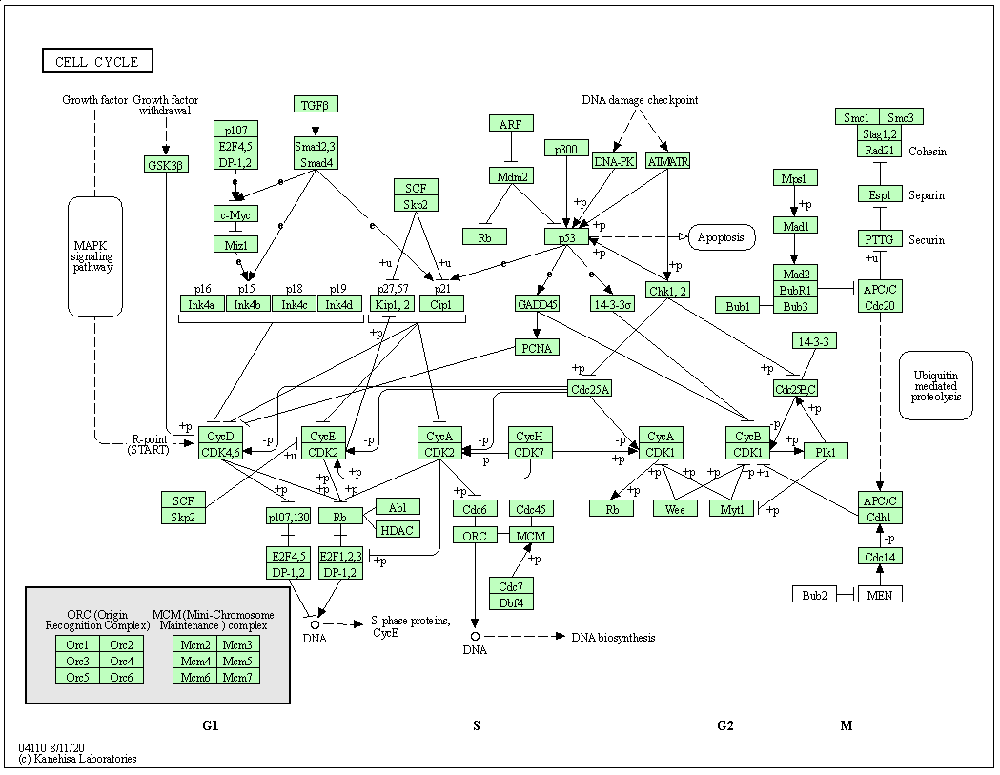

# Enrichment analyses {#sec:gsea}

```{r, message = FALSE, echo = FALSE}
library("GO.db")
library("org.Hs.eg.db")
```

**Motivation**: at the end of this chapter, the students will be able
to address the following points:

- What are the next steps after a differential expression analysis?
- Why are enrichment analyses useful?
- Understanding over-enrichment analyses.
- Understanding a gene set enrichment analysis.
- Application of the `r BiocStyle::Biocpkg("clusterProfiler")` package.

## Introduction

- Differential expression analysis is **univariate** - each gene is
  tested on its own. This probably doesn't reflect the underlying
  biology - genes work in conjunction, not in isolation. One wouldn't
  expect that the effect of a drug, or a mutation, ... would lead to
  the perturbation of a single gene expression.

- The univariate approach expects (or tests for) significant changes
  in single genes. Moderate effects in many (related) genes cannot, by
  definition be identified as statistically significant, even it such
  an effect may be biologically more plausible that one of a few large
  ones.

- The goal of an enrichment analysis is to test for a group of related
  genes, called **gene sets**, and test whether the genes within these
  sets are enriched for differentially expression.

## Gene sets

While nothing would stop a user to create their own gene sets, the
sets that are generally used stem from community-maintained resources. 

### Gene Ontology (GO)

The [Gene Ontology](http://geneontology.org/) [@Ashburner:2000]
defines GO terms. These terms are based on a controlled vocabulary (to
resuse the same words in a consistent way) and relations[^gorel] that
define the links between terms.

[^gorel]: Example of relations between terms are, for example, *is_a*
     (mitosis *is_a* cell cycle phase) or *part_of* (mitosis *part_of*
     M phase of mitotic cell cycle).

These terms are classed into three categories, called *namespaces*:

- Molecular Function (MF): molecular activities of gene products
- Cellular Component (CC): where gene products are active
- Biological Process (BP): pathways and larger processes made up of
  the activities of multiple gene products

Here's an example of GO term `GO:0007155`, that describes cell adhesion.

```
A Term from the GO ontology: GO:0007155 
 Label: cell adhesion
  The attachment of a cell, either to another cell or to an underlying
  substrate such as the extracellular matrix, via cell adhesion
  molecules.
```

If you look at the GO term `GO:0007155` [entry on the Gene Ontology
page](http://amigo.geneontology.org/amigo/term/GO:0007155), you can
find more details and, if you scroll down, example genes that are
annotated with that term.

```{r, echo=FALSE, fig.align='center', out.width='100%', fig.cap="Gene ontology entry for the GO term for cell adhesion."}
knitr::include_graphics("figs/go-screenshot.png")
```

The whole Gene Ontology is can be accessed in R with the 
`r BiocStyle::Biocpkg("GO.db")` package.


In the code chunk below, we query the `GO.db` package through the
`org.Hs.eg.db` interface. This *org.db* for Homo sapiens enables to
perform various queries for human genes, such as retrieving all gene
symbols and ENTREZ identifiers (the `columns` below) that are
annotated with a GO term (the `keys` below) of interest.

The GO term of interest here is focal adhesion:
```
A cell-substrate junction that anchors the cell to the extracellular
matrix and that forms a point of termination of actin filaments. In
insects focal adhesion has also been referred to as hemi-adherens
junction (HAJ).
```

```{r}
library("GO.db")
library("org.Hs.eg.db")
GO_0005925 <- select(org.Hs.eg.db,
                     keys = "GO:0005925",
                     columns = c("ENTREZID", "SYMBOL"),
                     keytype = "GO") %>%
    as_tibble %>%
    filter(!duplicated(ENTREZID))
GO_0005925
```

We have `r nrow(GO_0005925)` genes matching this GO term. There are
thus `r nrow(GO_0005925)` genes in the GO_0005925 GO set.

`r msmbstyle::question_begin()`

Repeat the code above to extract the genes annotated with the
`GO:0005813` term for the centrosome:

```
A structure comprised of a core structure (in most organisms, a pair
of centrioles) and peripheral material from which a
microtubule-based structure, such as a spindle apparatus, is
organized. Centrosomes occur close to the nucleus during interphase
in many eukaryotic cells, though in animal cells it changes
continually during the cell-division cycle.
```

`r msmbstyle::question_end()`


`r msmbstyle::solution_begin()`

```{r}
GO_0005813 <- select(org.Hs.eg.db,
                     keys = "GO:0005813",
                     columns = c("ENTREZID", "SYMBOL"),
                     keytype = "GO") %>%
    as_tibble %>%
    filter(!duplicated(ENTREZID))
GO_0005813
```

`r msmbstyle::solution_end()`

### Kyoto Encyclopedia of Genes and Genomes (KEGG)

[KEGG](https://www.genome.jp/kegg/pathway.html) pathway is a
collection of manually drawn and curated pathway maps representing
current knowledge of the molecular interaction, reaction and relation
networks. 

The figure below shows the [pathways for the cell
cycle](https://www.genome.jp/kegg-bin/show_pathway?hsa04110) in
humans.

```{r, echo=FALSE, fig.align='center', out.width='100%', fig.cap="KEGG pathway for cell cycle."}

```
The `r BiocStyle::Biocpkg("KEGGREST")` package provides a client interface to the KEGG server. 

### Reactome

Alike KEGG patway, [Reactome](https://reactome.org/) is a free,
open-source, curated and peer-reviewed pathway database. The
Bioconductor `r BiocStyle::Biocpkg("reactome.db")` package provides
access to reactome maps and annotations within R.


### Molecular Signatures Database (MySigDB)

MSigDB is a collection of annotated gene sets for use with GSEA
software. The MSigDB gene sets are divided into 9 collections:

- Hallmark gene sets (H) are coherently expressed signatures derived
  by aggregating many MSigDB gene sets to represent well-defined
  biological states or processes.
- Positional gene sets (C1) for each human chromosome and cytogenetic band.
- Curated gene sets (C2) from online pathway databases, publications
  in PubMed, and knowledge of domain experts.
- Regulatory target gene sets (C3) based on gene target predictions
  for microRNA seed sequences and predicted transcription factor
  binding sites.
- Computational gene sets (C4) defined by mining large collections of
  cancer-oriented microarray data.
- Ontology gene sets (C5) consist of genes annotated by the same
  ontology term.
- Oncogenic signature gene (C6) sets defined directly from microarray
  gene expression data from cancer gene perturbations.
- Immunologic signature gene sets (C7) defined directly from
  microarray gene expression data from immunologic studies.
- Cell type signature gene sets (C8) curated from cluster markers
  identified in single-cell sequencing studies of human tissue.

### Input data

To illustrate enrichment analyses, we will use the DESeq2 results
stored in the `res_tbl` variable, computed in the previous
chapter.

```{r, echo = FALSE}
res_tbl <- readRDS("./data/res_tbl.rds")
```

We will focus on the genes that have an adjusted p-value (those that
have been tested) and that have unique ENTREZ gene identifiers.

```{r}
res_tbl <- res_tbl %>%
    filter(!is.na(ENTREZID),
           !is.na(padj),
           !duplicated(ENTREZID)) %>%
    mutate(ENTREZID = as.character(ENTREZID))

res_tbl
```

## Over-enrichment analysis (ORA)

To perform an over-enrichment analysis, we need to define:

- among all the genes, which ones are differentially expressed (DE);
- among all the genes, which ones are part of the gene set of
  interest.

And fill out the following table and count the number of DE genes that
are in the set of interest, the non-DE that are in the set, and the DE
and non-DE genes that are not in the set:

```{r, eval = FALSE}
            
     | GO | !GO
-----+----+------
  DE | n  |  p
 !DE | m  |  q

```

```{r}
## DE and GO
n <- length(intersect(res_tbl$ENTREZID[res_tbl$padj < 0.05],
                      GO_0005925$ENTREZID))


## !DE and GO
m <- length(intersect(res_tbl$ENTREZID[res_tbl$padj >= 0.05],
                      GO_0005925$ENTREZID))

## DE and !GO
p <- length(setdiff(res_tbl$ENTREZID[res_tbl$padj < 0.05],
                    GO_0005925$ENTREZID))

## !DE not !GO
q <- length(setdiff(res_tbl$ENTREZID[res_tbl$padj >= 0.05],
                    GO_0005925$ENTREZID))
```

```{r}
cont_mat <- matrix(c(n, m, p, q), nrow = 2)
rownames(cont_mat) <- c("DE", "!DE")
colnames(cont_mat) <- c("GO", "!GO")
cont_mat
```

We can now apply a Fisher's exact (or hypergeometric test) that will
test whether we can identify a statistically enrichment of DE genes in
the GO category.

```{r}
fisher.test(cont_mat)
```

`r msmbstyle::question_begin()`

Repeat the ORA analysis above the GO:0005813 term.

`r msmbstyle::question_end()`


This approach is straightfoward and very fast. Its major drawback
however is that we need to define a cutoff to differentiate DE from
non-DE genes. Setting this threshold might have a effect on the
results. 


`r msmbstyle::question_begin()`

Try setting different DE genes and check if, in the cases above, this
has and effect on the GO terms of interest.

`r msmbstyle::question_end()`

## Gene set enrichment analysis (GSEA)

Gene set enrichment analysis refers to a broad family of tests. Here,
we will define the principles based on [@Subramanian:2005], keeping in
mind that the exact implementation will differ in different tools.

The major advantage of GSEA approaches is that they don't rely on
defining DE genes. The first step is to **order** the genes of
interest based on the statistics used, typically the p-values. This is
already the case for our `res_tbl` table. We also need to know which
genes are in our set of interest.

```{r}
res_tbl$inGO <- res_tbl$ENTREZID %in% GO_0005925$ENTREZID
dplyr::select(res_tbl, ENTREZID, padj, inGO)
```

We are now going to compute a score by traversing to ordered gene list
and count a positive score when we encounter a gene in the gene set,
and a -1 when the gene is not in the gene set. The positive score,
called `set_ratio` below, is computeted as as $\frac{n_{genes} -
n_{genes~in~set}}{n_{genes~in~set}}$ so that the sum of all genes in
the set and those not in the set becomes zero.

```{r}
set_ratio <- function(tbl) {
    (nrow(tbl) - sum(tbl$inGO))/sum(tbl$inGO)
}
```

The cumulative sum of these scores along the ordered gene list becomes
the GSEA path which is plotted below, and the maximun score obtained
along this path is the GSEA score.


```{r, fig.cap = "Gene set enrichment analysis path for term GO:0005925."}
gsea_path <- ifelse(res_tbl$inGO, set_ratio(res_tbl), -1)
gsea_path <- cumsum(gsea_path)
gsea_score <- max(gsea_path)
plot(gsea_path, type = "l",
     xlab = "Ordered genes (padj)", 
     ylab = "score",
     main = paste0("GSEA score: ", round(gsea_score)))
abline(h = gsea_score, col = "steelblue", lty = "dotted")
```

To be able to compute a statistical significance, we need to compute a
null distribution of GSEA scores, i.e. a distribution of scores
reflecting the absence of any enrichment. This is done by permuting
the samples in the original data, repeating the statistical analysis,
reorder the genes accodring to the new statistics (we used the
adjusted p-value above) and compute a new GSEA score.


```{r, message = FALSE}
dds_tmp <- dds
dds_tmp$Condition <- dds_tmp$Condition[sample(ncol(dds_tmp))]
colData(dds)
colData(dds_tmp)

res_tmp <- DESeq(dds_tmp) %>%
    results(name = "Condition_KD_vs_mock") %>%
    as_tibble(rownames = "ENSEMBL") %>%
    left_join(ensembl_to_geneName) %>%
    mutate(inGO = ENTREZID %in% GO_0005925$ENTREZID) %>%
    filter(!is.na(ENTREZID),
           !is.na(padj),
           !duplicated(ENTREZID)) %>%
    dplyr::select(ENSEMBL, ENTREZID, padj, inGO) %>%
    arrange(padj)

res_tmp <- res_tmp %>%
    mutate(score = ifelse(inGO, set_ratio(res_tmp), -1)) %>%
    mutate(score = cumsum(score))

res_tmp
```

```{r}
max(res_tmp$score)
plot(res_tmp$score, type = "l")
```

This approach is very time consuming, given that the statistical tests
for all the genes need to be recomputer at each permutation. In
addition, for experiments with limited number of samples, the number
of permutations would be limited.

We start by defining a function that will repeat the steps above and
return a list containing the GSEA score and path.

```{r}
##' A function that assigns the permuted Conditions,
##' runs DESeq and a GSEA analysis
##'
##' @param x a DESeq object.
##' @param perm character() of length `ncol(x)` indicating the
##'     permutation to be tested.
##'
##' @return A named list() of length 2 with the GSEA `score` and
##'     `path`.
gsea_perm <- function(x, perm) {
    ## Set the Condition based on the permutation
    x$Condition[perm] <- "mock"
    x$Condition[-perm] <- "KD"
    ## Run DESeq2, extract and annotate results
    suppressMessages(
        tbl <- DESeq(x) %>%
            results(name = "Condition_KD_vs_mock") %>%
            as_tibble(rownames = "ENSEMBL") %>%
            left_join(ensembl_to_geneName) %>%
            mutate(inGO = ENTREZID %in% GO_0005925$ENTREZID) %>%
            filter(!is.na(ENTREZID),
                   !is.na(padj),
                   !duplicated(ENTREZID)) %>%
            dplyr::select(ENSEMBL, ENTREZID, padj, inGO) %>%
            arrange(padj)
    )
    ## Compute GSEA results
    tbl <- tbl %>%
        mutate(score = if_else(inGO, set_ratio(tbl), -1)) %>%
        mutate(score = cumsum(score))
    list(score = max(tbl$score), path = tbl$score)
}
```

We will expecute this function on all unique permutations,
corresponding on the 10 first columns (including the actual design, in
the first column). Note that columns 11 to 20 are simply the opposite
of the first 10.

```{r}
(perms <- combn(6, 3))
```

We not apply our function on every permutation.

```{r, cache = TRUE}
gsea_scores <- apply(perms[, 1:10], 2, function(p) gsea_perm(dds, p))
```

And extract the scores and paths.

```{r}
paths <- sapply(gsea_scores, "[[", 2)
(scores <- sapply(gsea_scores, "[[", 1))
```

If we compare the actual score to the permutation scores, we see that
it is the largest one. 

```{r}
plot(density(scores))
rug(scores)
abline(v = scores[1])
```


An empirical p-value can be computer by dividing the number of null
scores that are greater than the real score divided by the number of
permutations (the number of null scores). In our case, given that no
null scores are greater, the nominal p-value would be 0.

```{r}
sum(scores > scores[1])/length(scores)
```

Below, we illustrate all GSEA path and confirm that the actual score
is indeed the largest one.

```{r, fig.cap = "Representation of all GSEA paths: real path (blue) and random paths (dotted grey)."}
plot(paths[[1]], type = "l",
     ylim = c(min(unlist(paths)), max(scores)),
     col = "steelblue")
grid()
for (i in 2:length(paths))
    lines(paths[[i]], type = "l", lty = "dotted")
```


`r msmbstyle::question_begin()`

Given that we have 10 permutations, how many null scores greater that
the actual GSEA score do we need for our results to become non
significant (assuming we set an alpha of 0.05)?

`r msmbstyle::question_end()`


`r msmbstyle::solution_begin()`

1 permutation score or more is enough to loose significativite, as a
single value greater than `r round(scores[1])` produces a p-value
of 1/10 = 0.1.

`r msmbstyle::solution_end()`

There exist various approaches to the GSEA analysis, that apply
different permutation approaches to increate the number of possible
permutations and reduce the running time.

`r msmbstyle::question_begin()`

Repeat the GSEA analysis above the GO:0005813 term.

`r msmbstyle::question_end()`


## Using the `clusterProfiler` package

I practice, the analyses presented above are executed using any of
[the very
many](http://bioconductor.org/packages/release/BiocViews.html#___GeneSetEnrichment)
packages that are available.
Here, we will demonstrate `r BiocStyle::Biocpkg("clusterProfiler")`.


```{r, eval = FALSE}
library("clusterProfiler")
ego <- enrichGO(gene = as.character(res_tbl$ENTREZ[res_tbl$padj < 0.05]),
                universe = as.character(res_tbl$ENTREZ),
                OrgDb = org.Hs.eg.db,
                ont = "CC",
                pAdjustMethod = "BH",
                pvalueCutoff = 1,
                qvalueCutoff = 1,
                readable = TRUE) %>%
    as_tibble
ego
```
