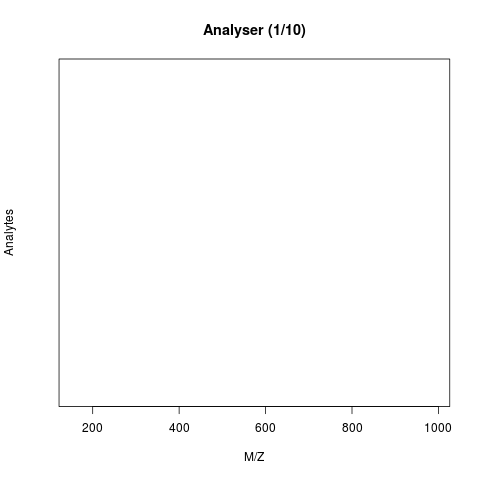
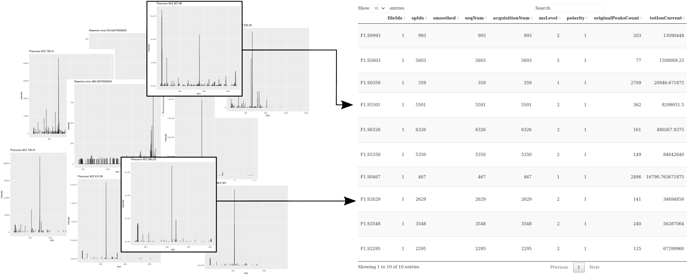
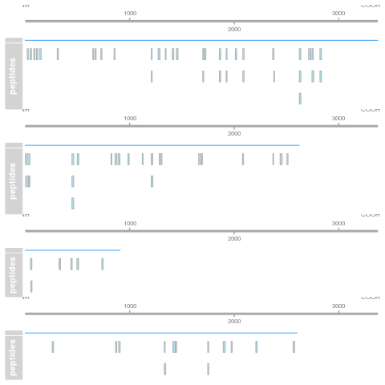
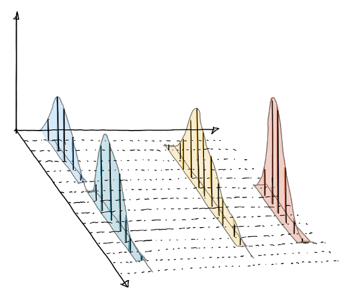

# Mass spectrometry {#sec-ms}

The **objectives** of this chapter it to learn how mass spectrometry
works and how mass spectrometry data is structured. At the end,
students should be familiar with

- Acquisition of spectra over retention time
- Spectra and chromatograms
- MS1 and MS2 spectra and their relation
- Precursor and fragment ions
- Peptide-spectrum matching
- An understanding of the various MS1, MS2, labelled and label-free
  quantitative approaches.


```{r, message = FALSE, echo = FALSE}
library("tidyverse")
library("Spectra")
library("magrittr")
library("ggplot2")
library("PSMatch")
```

Proteins as the functional units in all living organisms, and they are
highly dynamic. The caterpillar and the resulting butterfly have the
same genome. The complement of all the expressed proteins, termed the
proteome is however very different.


There are different modalities of the proteome that are of
interest. In addition to the presence or amount of protein in a
biological samples, it is also important to study the interactions
between proteins forming protein-protein complexes, the presence of
post-transcriptional modification (such as, for example,
phosphorylations), the rate at which proteins are produced and
degraded, or where the proteins reside inside a cell.

The technique of choice to study proteins in a high throughput way is
*mass spectrometry*.

*A beginner's guide to mass spectrometry–based proteomics*
[@Sinha:2020] is an approachable introduction to sample preparation,
mass spectrometry and data analysis.


## Setup

```{r sticker, fig.cap = "The `Spectra` package.", out.width = '50%', fig.margin=TRUE, echo=FALSE}
knitr::include_graphics("figs/Spectra.png")
```

We are going to use the Bioconductor [@Huber:2015] [`Spectra`
package](https://rformassspectrometry.github.io/Spectra/articles/Spectra.html),
which can be install with the `BiocManager` package, available from
CRAN. We will also make use of some test data from the `msdata`
package. Identification data will be handled by the
[`PSMatch`](https://rformassspectrometry.github.io/PSMatch/) package.


```{r, eval = FALSE}
BiocManager::install("msdata")
BiocManager::install("ProtGenerics")
BiocManager::install("Spectra")
BiocManager::install("RforMassSpectrometry/PSMatch")
```

## How does mass spectrometry work?

Mass spectrometry (MS) is a technology that *separates* charged
molecules (ions) based on their mass to charge ratio (M/Z). It is
often coupled to chromatography (liquid LC, but can also be gas-based
GC). The time an analytes takes to elute from the chromatography
column is the *retention time*.


```{r chrom, fig.cap="A chromatogram, illustrating the total amount of analytes over the retention time.", echo=FALSE, out.width = "100%"}
knitr::include_graphics("./figs/chromatogram.png")
```

An mass spectrometer is composed of three components:

1. The *source*, that ionises the molecules: examples are Matrix-assisted
   laser desorption/ionisation (MALDI) or electrospray ionisation.
   (ESI)
2. The *analyser*, that separates the ions: Time of flight (TOF) or Orbitrap.
3. The *detector* that quantifies the ions.

When using mass spectrometry for proteomics, the proteins are first
digested with a protease such as trypsin. In mass shotgun proteomics,
the analytes assayed in the mass spectrometer are peptides.

Often, ions are subjected to more than a single MS round. After a
first round of separation, the peaks in the spectra, called MS1
spectra, represent peptides. At this stage, the only information we
possess about these peptides are their retention time and their
mass-to-charge (we can also infer their charge be inspecting their
isotopic envelope, i.e the peaks of the individual isotopes, see
below), which is not enough to infer their identify (i.e. their
sequence).

In MSMS (or MS2), the settings of the mass spectrometer are set
automatically to select a certain number of MS1 peaks (for example
20). Once a narrow M/Z range has been selected (corresponding to one
high-intensity peak, a peptide, and some background noise), it is
fragmented (using for example collision-induced dissociation (CID),
higher energy collisional dissociation (HCD) or electron-transfer
dissociation (ETD)). The fragment ions are then themselves separated
in the analyser to produce a MS2 spectrum. The unique fragment ion
pattern can then be used to infer the peptide sequence using de novo
sequencing (when the spectrum is of high enough quality) of using a
search engine such as, for example Mascot, MSGF+, ..., that will match
the observed, experimental spectrum to theoratical spectra (see
details below).


```{r ms2, fig.cap="Schematics of a mass spectrometer and two rounds of MS.", echo=FALSE, out.width = "100%"}
knitr::include_graphics("figs/SchematicMS2.png")
```

The animation below show how 25 ions different ions (i.e. having
different M/Z values) are separated throughout the MS analysis and are
eventually detected (i.e. quantified). The final frame shows the
hypothetical spectrum.

```{r mstut, fig.cap="Separation and detection of ions in a mass spectrometer.", echo=FALSE, out.width = "80%"}

```

See also the Johannes Rainer's animations in the
[SpectraTutorials](https://jorainer.github.io/SpectraTutorials/articles/analyzing-MS-data-from-different-sources-with-Spectra.html)
vignette.

The figures below illustrate the two rounds of MS. The spectrum on the
left is an MS1 spectrum acquired after 21 minutes and 3 seconds of
elution. 10 peaks, highlited by dotted vertical lines, were selected
for MS2 analysis. The peak at M/Z 460.79 (488.8) is highlighted by a
red (orange) vertical line on the MS1 spectrum and the fragment
spectra are shown on the MS2 spectrum on the top (bottom) right
figure.

```{r ms, fig.cap="Parent ions in the MS1 spectrum (left) and two sected fragment ions MS2 spectra (right).", echo=FALSE, out.width = "100%"}
knitr::include_graphics("figs/MS1-MS2-spectra.png")
```

The figures below represent the 3 dimensions of MS data: a set of
spectra (M/Z and intensity) of retention time, as well as the
interleaved nature of MS1 and MS2 (and there could be more levels)
data.

```{r ms1s, fig.cap="MS1 spectra (blue) over retention time (left). MS2 spectra (pink) interleaved between two MS1 spectra (right),", echo=FALSE, fig.fullwidth=TRUE, out.width = "90%"}
knitr::include_graphics("figs/ms3D.png")
```

## Reading and accessing MS data

Let's start by accessing an MS raw data file from the `msdata`
package. The `proteomics()` function checks the package content for a
file matching the `"2014"` pattern and returns its full name.


```{r}
basename(f <- msdata::proteomics(pattern = "2014", full.names = TRUE))
```

There exist a set of community-maintained file formats for mass
spectrometry data. The most widely used formats are `mzML` and
`mzXML`, both relying on the
[XML](https://www.w3schools.com/xml/default.asp) markup
language. These two formats, as well as others, can be read into R as
`Spectra` objects:

```{r Spectra}
library("Spectra")
ms <- Spectra(f)
ms
```

Once a `Spectra` object has been created, it can be queried and
manipulated using a whole set of accessor functions, documented in the
[`Spectra`-class
documentation](https://rformassspectrometry.github.io/Spectra/reference/Spectra.html).

`Spectra` objects can be subset with the `[` operator. In addition to
the raw data (the M/Z and intensity values) that compose the
individual scans, the annotation of each spectrum is available as a
single and large table called *spectraData*, composed of a set of
*spectraVariables* columns.

```{r, fig.cap = "Schematic representation of what is referred to by MS data: a collection of spectra and a table containing spectrum-level annotations.", fig.fullwidth=TRUE, echo=FALSE}

```

`r msmbstyle::question_begin()`

Create a `Spectra` object as described above and reply to the
following questions:

- Use the `length()` function to check how many spectra have been
  acquired in this MS run?
- How many MS levels are there in this run? You can use the
  `msLevel()` accessor to get the MS level of all the scans.
- How many spectra of each MS level are there?
- For how long was the data acquired? Use the `rtime()` accessor to
  obtain the retention times.
- Which MS2 spectrum has the highest precursor intensity? The
  precursor intensities can be retrieved with the
  `precursorIntensity()` function.
- What is that's spectrum retention time and precuror M/Z? Use the
  `precursorMz()` and `rtime()` accessors.
- Visualise that spectrum using using the `plotSpectra()`
  function. Reproduce that figure youself by accessing the scan's raw
  data with the `intensity()` and `mz()` functions.

`r msmbstyle::question_end()`


The figure below show is an illustration of how mass spectrometry
works:

1. The chromatogram at the top display to total ion current along the
   retention time. The vertical line identifies one scan in particular
   at retention time 1800.68 seconds (the 2807th scan).

2. The spectra on the second line represent the full MS1 spectrum
   marked by the red line. The vertical lines identify the 10
   precursor ions that where selected for MS2 analysis. The zoomed in
   on the right shows one specific precursor peak.

3. The MS2 spectra displayed along the two rows at the bottom are
   those resulting from the fragmentation of the 10 precursor peaks
   identified by the vertical bars above.


```{r, fig.cap = "", out.width = "100%", echo = FALSE}
knitr::include_graphics("figs/msvisfig.png")
```


`r msmbstyle::question_begin()`

Reproduce the figure above.

`r msmbstyle::question_end()`


`r msmbstyle::solution_begin()`

1. The chromatogram can be created by extracting the `totIonCurrent`
   and `rtime` variables for all MS1 spectra:

```{r}
with(spectraData(filterMsLevel(ms, 1)),
     plot(rtime, totIonCurrent, type = "l"))
abline(v = rtime(ms)[2807], col = "red")
```

2. The `filterPrecursorScan()` function can be used to retains parent
   (MS1) and children scans (MS2) of a scan, as defined by its
   acquisition number.


```{r}
ms_2 <- filterPrecursorScan(ms, 2807)
plotSpectra(ms[2807], xlim = c(400, 1000))
abline(v = precursorMz(ms_2)[-1], col = "grey")
abline(v = precursorMz(ms_2)[2], col = "red")
```

```{r}
plotSpectra(ms[2807], xlim = c(521.2, 522.5), type = "l")
abline(v = precursorMz(ms_2)[2], col = "red")
```

3. The `plotSpectra()` function is used to plot all 10 MS2 spectra in
   one call.

```{r, fig.height = 12, fig.width = 8}
plotSpectra(ms_2[-1])
```
`r msmbstyle::solution_end()`

## Identification: matching spectra to peptides

The raw data is still a long way of obtaining biologically relevant
proteomics data. The first step is to identify the peptides that have
been acquired in the MS. Peptide identification works by comparing
expected and observed spectra. As shown below, when a precursor
peptide ion is fragmented in a CID cell, it breaks at specific bonds,
producing sets of peaks (*a*, *b*, *c* and *x*, *y*, *z*) that can be
predicted.


```{r frag, results='markup', fig.margin=FALSE, fig.cap="Peptide fragmentation.", echo=FALSE, out.width = "80%"}
knitr::include_graphics("figs/frag.png")
```

It is thus possible to calculate the expected set of fagment peaks for
a given peptide, such as *THSQEEMQHMQR* below and match these
theoretical fragments to those observed in MS2 spectra.


```{r, message = FALSE}
library("PSMatch")
calculateFragments("THSQEEMQHMQR")
```

In a full experiment, all possible peptides from the proteome of
interest (such as databases that can be downloaded from the [UniProt
site](https://www.uniprot.org/)[^uniprot]) are compared to the
millions of observed spectra.

[^uniprot]: The Universal Protein Resource (UniProt) is a freely and
    accessible comprehensive resource for protein sequence and
    annotation data.

The matching between millions of observed and possible spectra causes
real challenges due to the large search space and the risk of false
positives. See [@Kall:2008] for further reading.

### Handling identification results

Identification results are also stored in an XML-based file format,
called `mzIdentML` (or `mzId` for short). Below, we access such a file
available in the `msdata` package and load its content into R with the
`PSMs::PSM()` function.

```{r readPSMs}
basename(idf <- msdata::ident(full.names = TRUE))
id <- PSM(idf)
head(id)
```

`r msmbstyle::question_begin()`

How many of PSM entries originate from the real and decoy databases?

`r msmbstyle::question_end()`


`r msmbstyle::solution_begin()`

```{r}
table(id$isDecoy)
```

`r msmbstyle::solution_end()`


`r msmbstyle::question_begin()`

Visualise the `MS.GF.RawScore` densitues for the real and decoy
hits. Interprete the figures.

`r msmbstyle::question_end()`


`r msmbstyle::solution_begin()`

```{r}
library("ggplot2")
data.frame(id) %>%
    ggplot(aes(x = MS.GF.RawScore, colour = isDecoy)) +
    geom_density()
```

`r msmbstyle::solution_end()`


Before proceeding, we want to only focus on relevant peptides. The
`filterPSMs()` function will remove decoy peptides, only keep PSMs of
rank 1 (i.e. the best respective matches), and remove peptides that
match multiple proteins[^noteID].

[^noteID]: A more rigorous processing of these identifications would
    be required, for instance a way to evalutation the false discovery
    rate in these hits (which we know from above is very high). The
    `r BiocStyle::Biocpkg("MSnID")` is highly recommended.


```{r}
id <- filterPSMs(id)
```

For simplicity, we are also going to ignore the location of the
peptide modifications by removing the `modLocation` column.

```{r}
id$modLocation <- NULL
id <- unique(id)
```

Now that we have matching raw data (the `ms` variable) and
identification data (the `id` variable), it is possible to join the
latter to the former's spectra data:


```{r joinSpectraData}
ms <- joinSpectraData(ms, id,
                      by.x = "spectrumId",
                      by.y = "spectrumID")
ms
```

We are going to conlude this part by annotating an MS2 spectrum with
the calculated peptide fragment.

`r msmbstyle::question_begin()`

- Choose two MS2 spectra that have an `MS.GF.RawScore` greater than
  100 and are matched to the same peptide sequence.

- Then visualise them annotating their fragment ion with its fragment
  ions by passing the `addFragments` function to `plotSpectra`'s
  `labels` argument.

`r msmbstyle::question_end()`


`r msmbstyle::solution_begin()`

```{r, fig.height = 9, fig.width = 7, message = FALSE, fig.cap = "Two MS2 spectra that were matched to the `TKGLNVMQNLLTAHPDVQAVFAQNDEMALGALR` peptide."}
seq <- as_tibble(spectraData(ms)) %>%
    filter(`MS.GF.RawScore` > 100) %>%
    group_by(sequence) %>%
    summarise(n = n()) %>%
    filter(n == 2) %>%
    head(1) %>%
    pull(sequence)

i <- which(ms$sequence == seq)

plotSpectra(ms[i], labels = addFragments,
            labelPos = 3, labelCol = "orange",
            main = ms[i]$sequence)
```

For a more direct comparision, the two spectra can also be represented
on the same graph pointing upwards and downwards:


```{r, fig.height = 5, fig.width = 7, message = FALSE, warning = FALSE, fig.cap = "Mirror representation of to matches to the `TKGLNVMQNLLTAHPDVQAVFAQNDEMALGALR` peptide."}
plotSpectraMirror(ms[i[1]], ms[i[2]],
                  labels = addFragments,
                  labelPos = 3, labelCol = "orange")
```

`r msmbstyle::solution_end()`


From the list of identified peptides, it is then necessary to infer
the most provable proteins that were present in the biological
sample. **Protein inference** is a difficult task, as peptides often
match multiple proteins (either different isoforms or proteins
stemming from different gene but with identical domains), which leads
to the definition of protein groups, i.e. sets of proteins that can't
be distinguished with the set of identified peptides at hand. See
[@Nesvizhskii:2005] for further reading.


## Quantitative proteomics

The last step of MS data processing is to quantify peptide abundances
in the biological samples. The table below summarises the different
possibilites depending whether the proteins or peptides are labelled,
and whether the quantitation is performed in MS1 or MS2.


|    |Label-free |Labelled   |
|:---|:----------|:----------|
|MS1 |XIC        |SILAC, 15N |
|MS2 |Counting   |iTRAQ, TMT |


### Label-free MS2: Spectral counting

In spectral counting, on simply counts the number of quantified
peptides that are assigned to a protein.

```{r sc, echo=FALSE, out.width = "75%", fig.cap = "Spectral counting. Figure from the `Pbase` package."}

```

### Labelled MS2: Isobaric tagging

Isobaric tagging refers to the labelling using isobaric tags,
i.e. chemical tags that have the same mass and hence can't be
distinguish by the spectrometer. The peptides of different samples (4,
6, 10, 11 or 16) are labelled with different tags and combined prior
to mass spectrometry acquisition. Given that they are isobaric, all
identical peptides, irrespective of the tag and this the sample of
origin, are co-analysed, up to fragmentation prior to MS2
analysis. During fragmentation, the isobaric tags fall of, fragment
themselves, and result in a set of sample specific peaks. These
specific peaks can be used to infer sample-specific quantitation,
while the rest of the MS2 spectrum is used for identification.

```{r itraq, echo=FALSE, out.width = "75%", fig.cap = "iTRAQ 4-plex isobaric tagging. Tandem Mass Tags (TMT) offer up to 16 tags."}
knitr::include_graphics("./figs/itraq.png")
```

### Label-free MS1: extracted ion chromatograms

In label-free quantitation, the precursor peaks that match an
identified peptide are integrated of retention time and the area under
that *extracted ion chromatogram* is used to quantify that peptide in
that sample.

```{r lf, echo=FALSE, out.width = "75%", fig.cap = "Label-free quantitation. Figure credit [Johannes Rainer](https://github.com/jorainer/)."}

```


### Labelled MS1: SILAC

In SILAc quantitation, sample are grown in a medium that contains
heavy amino acids (typically arginine and lysine). All proteins gown
in this *heavy* growth medium contain the heavy form of these amino
acids. Two samples, one grown in heavy medium, and one grown in normal
(light) medium are then combined and analysed together. The heavy
peptides precursor peaks are systematically shifted compared to the
light ones, and the ratio between the height of a heavy and light
peaks can be used to calculate peptide and protein fold-changes.


```{r silab, echo=FALSE, out.width = "75%", fig.cap = "Silac quantitation. Figure credit Wikimedia Commons."}
knitr::include_graphics("./figs/Silac.png")
```

These different quantitation techniques come with their respective
benefits and distinct challenges, such as large quantities of raw data
processing, data transformation and normalisation, missing values, and
different underlying statistical models for the quantitative data
(count data for spectral counting, continuous data for the others).

The next chapter will focus on the handling and processing of
quantitative proteomics data.
