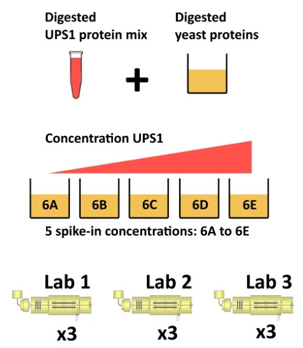

# Quantitative proteomics data analysis {#sec-prot}

**Learning Objectives**

The goals of this chapter are to provide a real-life example of
step-by-step quantitative proteomics data analysis.

## Introduction

Mass spectrometry-based quantitative proteomics data can be
representated as a matrix of quantitative values for features (PSMs,
peptides, proteins) arranged along the rows, measured for a set of
samples, arranged along the columns. The is a common representation
for any quantitative data set. As already done in
[this](https://uclouvain-cbio.github.io/WSBIM2122/sec-rnaseq.html#running-deseq2)
and
[previous](https://uclouvain-cbio.github.io/WSBIM1322/sec-obj.html#examples-from-the-bioconductor-project)
course, we will be using the `SummarizedExperiment` class:

```{r sefig, echo = FALSE, fig.cap = "Schematic representation of the anatomy of a `SummarizedExperiment` object. (Figure taken from the `SummarizedExperiment` package vignette.)"}
knitr::include_graphics("./figs/SE.svg")
```

- The sample (columns) metadata can be access with the `colData()`
  function.
- The features (rows) metadata can be access with the `rowData()`
  column.
- If the features represent ranges along genomic coordinates, these
  can be accessed with `rowRanges()`
- Additional metadata describing the overall experiment can be
  accessed with `metadata()`.
- The quantiative data can be accessed with `assay()`.
- `assays()` returns a list of matrix-like assays.

## QFeatures

As we have already discussed in the previous chapter, even though mass
spectrometers acquire data for spectra/peptides, the biological
entities of interest remain the proteins. As part of the data
processing, we are thus required to **aggregate** low-level
quantitative features into higher level data.


```{r featuresplot, fig.cap = "Conceptual representation of a `QFeatures` object and the aggregative relation between different assays.", echo = FALSE}
par(mar = c(0, 0, 0, 0))
plot(NA, xlim = c(0, 12), ylim = c(0, 20),
     xaxt = "n", yaxt = "n",
     xlab = "", ylab = "", bty = "n")

for (i in 0:7)
    rect(0, i, 3, i+1, col = "lightgrey", border = "white")


for (i in 8:12)
    rect(0, i, 3, i+1, col = "steelblue", border = "white")

for (i in 13:18)
    rect(0, i, 3, i+1, col = "orange", border = "white")

for (i in 19)
    rect(0, i, 3, i+1, col = "darkgrey", border = "white")


for (i in 5:7)
    rect(5, i, 8, i+1, col = "lightgrey", border = "white")

for (i in 8:10)
    rect(5, i, 8, i+1, col = "steelblue", border = "white")

for (i in 11:13)
    rect(5, i, 8, i+1, col = "orange", border = "white")

for (i in 14)
    rect(5, i, 8, i+1, col = "darkgrey", border = "white")

rect(9, 8, 12, 8+1, col = "lightgrey", border = "white")
rect(9, 9, 12, 9+1, col = "steelblue", border = "white")
rect(9, 10, 12, 10+1, col = "orange", border = "white")
rect(9, 11, 12, 11+1, col = "darkgrey", border = "white")

segments(3, 8, 5, 8, lty = "dashed")
segments(3, 6, 5, 7, lty = "dashed")
segments(3, 4, 5, 6, lty = "dashed")
segments(3, 0, 5, 5, lty = "dashed")

segments(3, 10, 5, 9, lty = "dashed")
segments(3, 11, 5, 10, lty = "dashed")
segments(3, 13, 5, 11, lty = "dashed")

segments(3, 14, 5, 12, lty = "dashed")
segments(3, 16, 5, 13, lty = "dashed")
segments(3, 19, 5, 14, lty = "dashed")

segments(3, 20, 5, 15, lty = "dashed")


segments(8, 5, 9, 8, lty = "dashed")
segments(8, 8, 9, 9, lty = "dashed")
segments(8, 11, 9, 10, lty = "dashed")
segments(8, 14, 9, 11, lty = "dashed")
segments(8, 15, 9, 12, lty = "dashed")
```

We are going to start to familiarise ourselves with the `QFeatures`
class implemented in the [`QFeatures`
package](https://rformassspectrometry.github.io/QFeatures/articles/QFeatures.html). Let's
start by loading the `tidyverse` and `QFeatures` packages.

```{r sticker2, fig.cap = "The `QFeatures` package.", out.width = '50%', fig.margin=TRUE, echo=FALSE}
knitr::include_graphics("figs/QFeatures.png")
```

```{r, message = FALSE}
library("tidyverse")
library("ggplot2")
library("QFeatures")
library("limma")
```

Next, we load the `feat1` test data, which is composed of single
*assay* of class `SummarizedExperiment` composed of 10 rows and 2
columns.

```{r}
data(feat1)
feat1
```

`r msmbstyle::question_begin()`

Perform the following to familiarise yourselves with the `QFeatures` class:

- Extract the sample metadata using the `colData()` accessor (like you
  have previously done with `SummarizedExperiment` objects).

- Extract the first (and only) assay composing this `QFeaures` data
  using the `[[` operator (as you have done to extract elements of a
  list) by using the assay's index or name.

- Extract the `psms` assay's row data and quantitative values.

`r msmbstyle::question_end()`


`r msmbstyle::solution_begin()`

```{r}
colData(feat1)
```

```{r}
feat1[[1]]
feat1[["psms"]]
```

```{r}
assay(feat1[[1]])
rowData(feat1[[1]])

```
`r msmbstyle::solution_end()`


## Feature aggregation


The central functionality of the `QFeatures` infrastructure is the
aggregation of features into higher-level features while retaining the
link between the different levels. This can be done with the
[`aggregateFeatures()`
function](https://rformassspectrometry.github.io/QFeatures/reference/QFeatures-aggregate.html).

The call below will

- operate on the `psms` assay of the `feat1` objects;
- aggregate the rows the assay following the grouping defined in the
  `peptides` row data variables;
- perform aggregation using the `colMeans()` function;
- create a new assay named `peptides` and add it to the `feat1`
  object.

```{r}
feat1 <- aggregateFeatures(feat1, i = "psms",
                           fcol = "Sequence",
                           name = "peptides",
                           fun = colMeans)
feat1
```

`r msmbstyle::question_begin()`

- Convince yourself that you understand the effect of feature
  aggregation.
- Repeat the calculations manually.
- Observe the content of the new assay's row data.

`r msmbstyle::question_end()`


`r msmbstyle::solution_begin()`

```{r}
## SYGFNAAR
colMeans(assay(feat1[[1]])[1:3, ])
assay(feat1[[2]])["SYGFNAAR", ]

## ELGNDAYK
colMeans(assay(feat1[[1]])[4:6, ])
assay(feat1[[2]])["ELGNDAYK", ]

## IAEESNFPFIK
colMeans(assay(feat1[[1]])[7:10, ])
assay(feat1[[2]])["IAEESNFPFIK", ]
```

```{r}
rowData(feat1[[2]])
```

`r msmbstyle::solution_end()`

`r msmbstyle::question_begin()`

Aggregate the peptide-level data into a new protein-level assay using
the `colMedians()` aggregation function.

`r msmbstyle::question_end()`


`r msmbstyle::solution_begin()`

```{r}
feat1 <- aggregateFeatures(feat1, i = "peptides",
                           fcol = "Protein",
                           name = "proteins",
                           fun = colMedians)
feat1
assay(feat1[["proteins"]])
```

`r msmbstyle::solution_end()`


## Subsetting and filtering

The link between the assays becomes apparent when we now subset the
assays for protein A as shown below or using the `subsetByFeature()`
function. This creates a new instance of class `QFeatures` containing
assays with the expression data for protein, its peptides and their
PSMs.

```{r}
feat1["ProtA", , ]
```


The `filterFeatures()` function can be used to filter rows the assays
composing a `QFeatures` object using the row data variables. We can
for example retain rows that have a `pval` < 0.05, which would only
keep rows in the `psms` assay because the `pval` is only relevant for
that assay.

```{r}
filterFeatures(feat1, ~ pval < 0.05)
```

On the other hand, if we filter assay rows for those that localise to
the mitochondrion, we retain the relevant protein, peptides and PSMs.

```{r}
filterFeatures(feat1, ~ location == "Mitochondrion")
```

`r msmbstyle::question_begin()`

Filter rows that do not localise to the mitochondrion.

`r msmbstyle::question_end()`

`r msmbstyle::solution_begin()`

```{r}
filterFeatures(feat1, ~ location != "Mitochondrion")
```

`r msmbstyle::solution_end()`

You can refer to the [*Quantitative features for mass spectrometry
data*](https://rformassspectrometry.github.io/QFeatures/articles/QFeatures.html)
vignette and the `QFeature` [manual
page](https://rformassspectrometry.github.io/QFeatures/reference/QFeatures-class.html)
for more details about the class.

## Analysis pipeline

Quantitative proteomics data processing is composed of the following
steps:

- Data import
- Exploratory data analysis (PCA)
- Missing data management (filtering and/or imputation)
- Data cleaning
- Transformation and normalisation
- Aggregation
- Downstream analysis


## The CPTAC data

The CPTAC spike-in study 6 [@Paulovich:2010] combines the Sigma UPS1
standard containing 48 different human proteins that are spiked in at
5 different concentrations (conditions A to E) into a constant yeast
protein background. The sample were acquired in triplicate on
different instruments in different labs. We are going to start with a
subset of the CPTAC study 6 containing conditions A and B for a single
lab.

```{r cptac, echo = FALSE, fig.cap = "The CPTAC spike-in study design (credit Lieven Clement, statOmics, Ghent University).", out.width='70%', fig.align='center'}

```

The peptide-level data, as processed by MaxQuant [@Cox:2008] is
available in the `msdata` package:


```{r msdata}
basename(f <- msdata::quant(pattern = "cptac", full.names = TRUE))
```

From the names of the columns, we see that the quantitative columns,
starting with `"Intensity."` (note the dot!) are at positions 56 to
61.

```{r cptac_cols}
names(read.delim(f))
(i <- grep("Intensity\\.", names(read.delim(f))))
```

We now read these data using the `readSummarizedExperiment`
function. This peptide-level expression data will be imported into R
as an instance of class `SummarizedExperiment`. We also use the
`fnames` argument to set the row-names of the `peptides` assay to the
peptide sequences and specify that the file is a tab-separated table.

```{r}
cptac_se <- readSummarizedExperiment(f, ecol = i, fnames = "Sequence", sep = "\t")
cptac_se
```

Before proceeding, we are going to clean up the sample names and
annotate the experiment:

```{r}
colnames(cptac_se) <- sub("I.+\\.", "", colnames(cptac_se))
cptac_se$condition <- sub("_[7-9]", "", colnames(cptac_se))
cptac_se$id <- sub("^.+_", "", colnames(cptac_se))
colData(cptac_se)
```

Let's also keep only a subset of

```{r}
keep_var <- c("Sequence", "Proteins", "Leading.razor.protein", "PEP",
              "Score", "Reverse", "Potential.contaminant")

rowData(cptac_se) <- rowData(cptac_se)[, keep_var]
```

## Missing values

Missing values can be highly frequent in proteomics. These exist two
reasons supporting the existence of missing values, namely biological
or technical.

1. Values that are missing due to the absence (or extremely low
   contentration) of a protein are observed for biological reasons,
   and their pattern **aren't random**. A protein missing in due to
   the suppression of its expression will not be missing at random: it
   will be missing in the condition in which it was suppressed, and be
   present in the condition where it is expressed.

2. Due to it's data-dependent acquisition, mass spectrometry isn't
   capable to assaying all peptides in a sample. Peptides that are
   less abundant than some of their co-eluting ions, peptides that do
   not ionise well or peptides that do not get identified might be
   sporadically missing in the final quantitation table, despite their
   presence in the biological samples. Their absence patterns are
   **random** in such cases.

Often, third party software that produce quantiative data use zeros
instead of properly reporting missing values. We can use the
`zeroIsNA()` function to replace the `0` by `NA` values in our
`cptac_se` object and then explore the missing data patterns across
columns and rows.


```{r}
cptac_se <- zeroIsNA(cptac_se)
nNA(cptac_se)
```

```{r, echo = FALSE, fig.cap = "Distribution of missing value (white). Peptides row with more missing values are moved towards the top of the figure."}
.image2 <- function (x, yticks = 10,
                     x.cex.axis = 0.75,
                     y.cex.axis = 0.75,
                     xlab = "Samples",
                     ylab = "Features", ...) {
    nc <- ncol(x)
    nr <- nrow(x)
    lab <- colnames(x)
    if (is.null(lab))
        lab <- 1:nc
    graphics::image(t(x), xlab = xlab, ylab = ylab,
                    xaxt = "n",
                    yaxt = "n", ...)
    axis(1, seq(0, 1, 1/(nc - 1)), labels = lab, cex.axis = x.cex.axis)
    yticks <- seq(0, 1, 1/(yticks - 1)) * nr
    axis(2, seq(0, 1, 1/(length(yticks) - 1)),
         labels = round(yticks, 0),
         cex.axis = y.cex.axis)
    invisible(NULL)
}
.x <- is.na(assay(cptac_se))
o <- order(rowSums(.x))
.image2(.x[o, ],
        col = c("black", "white"),
        ylab = "Peptides")
```

`r msmbstyle::question_begin()`

- Explore the number or proportion of missing values across peptides
  and samples of the `cptac_se` data.

- Remove row that have *too many* missing values. You can do this by
  hand or using the `filterNA()` function.

`r msmbstyle::question_end()`


`r msmbstyle::solution_begin()`

```{r}
barplot(nNA(cptac_se)$nNAcols$pNA)

table(nNA(cptac_se)$nNArows$nNA)
```

```{r}
## remove rows that have 4 or more NAs out of 6
cptac_se <- filterNA(cptac_se, pNA = 4/6)
```

`r msmbstyle::solution_end()`


## Imputation

Imputation is the technique of replacing missing data with probable
values. This can be done with `impute()` method. As we have discussed
above, there are however two types of missing values in mass
spectrometry-based proteomics, namely data missing at random (MAR),
and data missing not at random (MNAR). These two types of missing data
need to be imputed with [different types of imputation
methods](https://rformassspectrometry.github.io/QFeatures/articles/Processing.html#imputation-1)
[@Lazar:2016].


```{r miximp, echo = FALSE, fig.cap = "Mixed imputation method. Black cells represent presence of quantitation values and light grey corresponds to missing data. The two groups of interest are depicted in green and blue along the heatmap columns. Two classes of proteins are annotated on the left: yellow are proteins with randomly occurring missing values (if any) while proteins in brown are candidates for non-random missing value imputation."}
data(se_na2)
x <- assay(impute(se_na2, "zero"))
x[x != 0] <- 1
suppressPackageStartupMessages(library("gplots"))
heatmap.2(x, col = c("lightgray", "black"),
          scale = "none", dendrogram = "none",
          trace = "none", keysize = 0.5, key = FALSE,
          RowSideColors = ifelse(rowData(se_na2)$randna, "orange", "brown"),
          ColSideColors = rep(c("steelblue", "darkolivegreen"), each = 8))
```

When downstream analyses permit, it might thus be safer not to impute
data and deal explicitly with missing values. This is possible when
performing hypethesis tests, but not to perform a principal component
analysis.


## Identification quality control

As discussed in the previous chapter, PSMs are deemed relevant after
comparison against hist from a decoy database. The origin of these
hits is recorded with `+` in the `Reverse` variable:

```{r}
table(rowData(cptac_se)$Reverse)
```

Similarly, a proteomics experiment is also searched against a database
of contaminants:

```{r}
table(rowData(cptac_se)$Potential.contaminant)
```

`r msmbstyle::question_begin()`

- Visualise the score distributions from forward and reverse hits and
  interpret the figure.

- Do the same with the posterior probability score (PEP).

`r msmbstyle::question_end()`


`r msmbstyle::solution_begin()`

```{r}
rowData(cptac_se) %>%
    as_tibble() %>%
    ggplot(aes(x = Score, colour = Reverse)) +
    geom_density()

```

```{r}
rowData(cptac_se) %>%
    as_tibble() %>%
    ggplot(aes(x = PEP, colour = Reverse)) +
    geom_density()
```
`r msmbstyle::solution_end()`


## Creating the QFeatures data

We can now create our `QFeatures` object using the
`SummarizedExperiment` as show below.

```{r}
cptac <- QFeatures(list(peptides = cptac_se))
```

We should also assign the `QFeatures` column data with the
`SummarizedExperiment` slot.

```{r}
colData(cptac) <- colData(cptac_se)
```

Note that it is also possible to directly create a `QFeatures` object
with the `readQFeatures()` function and the same arguments as the
`readSummarizedExperiment()` used above. In addition, most functions
used above and below work on single `SummarizedExperiment` objects or
assays within a `QFeatures` object.


## Filtering out contaminants and reverse hits

`r msmbstyle::question_begin()`

Using the `filterFeatures()` function, filter out the reverse and
contaminant hits.

`r msmbstyle::question_end()`


`r msmbstyle::solution_begin()`

```{r}
cptac <-
    cptac %>%
    filterFeatures(~ Reverse != "+") %>%
    filterFeatures(~ Potential.contaminant != "+")
```

`r msmbstyle::solution_end()`


## Log-transformation and normaliation


The two code chunks below log-transform and normalise using the assay
`i` as input and adding a new one names as defined by `name`.

```{r}
cptac <- logTransform(cptac, i = "peptides",
                      name = "log_peptides")
```

```{r}
cptac <- normalize(cptac, i = "log_peptides",
                   name = "lognorm_peptides", method = "quantiles")
```

```{r, fig.cap = "Three peptide level assays: raw data, log transformed and normalised.", fig.width = 15, fig.height = 5, fig.fullwidth = TRUE}
par(mfrow = c(1, 3))
limma::plotDensities(assay(cptac[["peptides"]]))
limma::plotDensities(assay(cptac[["log_peptides"]]))
limma::plotDensities(assay(cptac[["lognorm_peptides"]]))
```

## Aggregation

Below, we are going to use median aggregation, as a first
attempt. This is however not the best choice, as we will see later.


```{r, message = FALSE}
cptac <-
    aggregateFeatures(cptac,
                      "lognorm_peptides",
                      name = "proteins_med",
                      fcol = "Leading.razor.protein",
                      fun = colMedians,
                      na.rm = TRUE)
```

Looking at the `.n` row variable computed during the aggregation, we
see that most proteins result of the aggregation of 5 peptides or
less, while very few proteins are accounted for by tens of peptides.

```{r}
table(rowData(cptac[["proteins_med"]])$.n)
```

## Principal component analysis


```{r, message = FALSE}
library("factoextra")
library("patchwork")

pca_pep <-
    cptac[["lognorm_peptides"]] %>%
    filterNA() %>%
    assay() %>%
    t() %>%
    prcomp(scale = TRUE, center = TRUE) %>%
    fviz_pca_ind(habillage = cptac$condition, title = "Peptides")

pca_prot <-
    cptac[["proteins_med"]] %>%
    filterNA() %>%
    assay() %>%
    t() %>%
    prcomp(scale = TRUE, center = TRUE) %>%
    fviz_pca_ind(habillage = cptac$condition,
                 title = "Proteins (median aggregation)")

```

```{r, fig.fullwidth = TRUE, fig.width = 12, fig.height = 6, fig.cap = "Peptide and protein level PCA analyses."}
pca_pep + pca_prot
```


`r msmbstyle::question_begin()`

Interpret the two PCA plots above.

`r msmbstyle::question_end()`


## Visualisation


Below, we use the `longFormat()` function to extract the quantitative
and row data in a long format, that can be directly reused by the
tidyverse tools.


```{r, message = FALSE, warning = FALSE, fig.width = 12, fig.height = 6, fig.cap = "Peptide and protein expression profile.", fig.fullwidth = TRUE}
longFormat(cptac["P02787ups|TRFE_HUMAN_UPS", ,
                 c("lognorm_peptides", "proteins_med")]) %>%
    as_tibble() %>%
    mutate(condition = ifelse(grepl("A", colname), "A", "B")) %>%
    ggplot(aes(x = colname, y = value, colour = rowname, shape = condition)) +
    geom_point(size = 3) +
    geom_line(aes(group = rowname)) +
    facet_grid(~ assay) +
    ggtitle("P02787ups|TRFE_HUMAN_UPS")
```

## Statistical analysis


Below, we are going to perform our statistical analysis on the protein
data.


```{r}
prots <- cptac[["proteins_med"]]
colData(prots) <- colData(cptac)
```

We have seen in chapter \@ref(sec-linmod) how to use linear models and
have applied the same prinicples in chapter \@ref(sec-rnaseq) on count
data (based on a negative binomial distribution).
The `r BiocStyle::Biocpkg("limma")` package is the precursor package that
enables the consistent application of linear models to normalliy
distributed omics data in general, and microarrays in
particuar[^limma].

[^limma]: The name of the package refers to *Linear Models for Microarray Data*.

The `limma` package also implements an empirical Bayes method that
provides borrows information across features to estimate the standard
error[^shrinkage] and calculate (so called moderate) t
statistics. This approach is demonstrably more powerful that a
standard t-tests when the number of samples is lot.

[^shrinkage]: alike the shinkage gene-wise dispersion estimates see in
    `DESeq2`.


The code chunk below illstrated how to set up the model, fit it, and
apply the empirical Bayes moderation.

```{r, message = FALSE}
library("limma")
design <- model.matrix(~ prots$condition)
fit <- lmFit(assay(prots), design)
fit <- eBayes(fit)
```

Finally, the `topTable()` function is used the extract the results for
the coefficient of interest.

```{r}
res <-
    topTable(fit, coef = "prots$condition6B", number = Inf) %>%
    rownames_to_column("protein") %>%
    as_tibble() %>%
    mutate(TP = grepl("ups", protein))
```

`r msmbstyle::question_begin()`

Note the warning about partial `NA` coefficients for 23 probes. Where
could these come from?

`r msmbstyle::question_end()`

`r msmbstyle::solution_begin()`

```{r}
na_coefs <-
    filter(res, is.na(t)) %>%
    pull(protein)
assay(prots[na_coefs, ])
```

`r msmbstyle::solution_end()`


```{r}
vp <-
    res %>%
    ggplot(aes(x = logFC, y = -log10(adj.P.Val))) +
    geom_point(aes(colour = TP)) +
    geom_vline(xintercept = c(-1, 1)) +
    geom_hline(yintercept = -log10(0.05)) +
    scale_color_manual(values = c("black","red"))
```


```{r, message = FALSE}
library("plotly")
ggplotly(vp)
```

Using the pipeline described above, we would would identify a single
differentially expressed protein at an 5 percent FDR but miss out the
other `r sum(res$TP[!is.na(res$adj.P.Val)]) - 1` expected spike-in
proteins.
We can assess our results in terms of true/false postitves/negatives:

- True positives: `r nrow(filter(res, adj.P.Val < 0.05 & TP))`
- False positives: `r nrow(filter(res, adj.P.Val < 0.05 & !TP))`
- True negatives: `r nrow(filter(res, adj.P.Val > 0.05 & !TP))`
- False negatives: `r nrow(filter(res, adj.P.Val > 0.05 & TP))`


As shown below, it is possible to substantially improve these results
using robust summarisation, i.e robust regression with M-estimation
using Huber weights, as described in section 2.7 in [@Sticker:2019].

```{r echo = FALSE, message = FALSE, warning = FALSE, fig.cap = "Aggregation using robust summarisation."}
cptac <-
    aggregateFeatures(cptac,
                      "lognorm_peptides",
                      name = "proteins_rob",
                      fcol = "Leading.razor.protein",
                      fun = MsCoreUtils::robustSummary,
                      na.rm = TRUE)

prots <- cptac[["proteins_rob"]]
colData(prots) <- colData(cptac)

design <- model.matrix(~ prots$condition)
fit <- lmFit(assay(prots), design)
fit <- eBayes(fit)

res <- topTable(fit, coef = "prots$condition6B", number = Inf) %>%
    rownames_to_column("protein") %>%
    as_tibble() %>%
    mutate(TP = grepl("ups", protein))

res %>%
    ggplot(aes(x = logFC, y = -log10(adj.P.Val))) +
    geom_point(aes(colour = TP)) +
    geom_vline(xintercept = c(-1, 1)) +
    geom_hline(yintercept = -log10(0.05)) +
    scale_color_manual(values = c("black","red"))
```

- True positives: `r nrow(filter(res, adj.P.Val < 0.05 & TP))`
- False positives: `r nrow(filter(res, adj.P.Val < 0.05 & !TP))`
- True negatives: `r nrow(filter(res, adj.P.Val > 0.05 & !TP))`
- False negatives: `r nrow(filter(res, adj.P.Val > 0.05 & TP))`

## Project

You are provided with the [larger CPTAC
data](./data/cptac_a_b_c_peptides.txt) including a third condition
(namely C) and a two additional lab, tallying now 27 samples.

```{r, echo = FALSE}
f <- "./data/cptac_a_b_c_peptides.txt"
i <- grep("Intensity\\.", names(read.delim(f)))
cptac2 <- readSummarizedExperiment(f, ecol = i,
                                   sep = "\t",
                                   fnames = "Sequence")
colnames(cptac2) <- sub("I.+\\.", "", colnames(cptac2))
cptac2$id <- sub("6.+_", "", colnames(cptac2))
cptac2$condition <- sub("_[1-9]", "", colnames(cptac2))
cptac2$lab <- rep(rep(c("LTQ-Orbitrap_86",
                       "LTQ-OrbitrapO_65",
                       "LTQ-OrbitrapW_56"), each = 3),
                  3)

write.csv(colData(cptac2), file = "./data/cptac_coldata.csv")
knitr::kable(table(colData(cptac2)[, -1]))
```
The full design is shown below and is available [here](./data/cptac_coldata.csv).

```{r, echo=FALSE}
cd <- data.frame(colData(cptac2))
cd$previous <- "new"
cd[colnames(cptac_se), "previous"] <- ""
knitr::kable(cd, rownames = TRUE)
```
