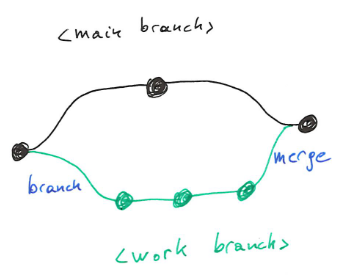

# Annex: Collaborating with Git and GitHub {#sec-git}

This chapter is based/adapted on content from [Happy Git and GitHub
for the useR](https://happygitwithr.com/) and [Version Control with
Git](https://swcarpentry.github.io/git-novice).

## Motivation

In the past, students have reported the difficulty of collaborative
work on R code and Rmd files. Each student work with RStudio on their
local computer, and share the code, report and data files on shared
drive and/or send updates by email. Such a situation may lead to a well
known situation, nicely caught by the 'notFinal.doc' PhD Comic:


```{r notFinal, fig.cap="The 'notFinal.doc' [PhD Comic](https://phdcomics.com/comics/archive.php?comicid=1531), describing the very real struggle with trying to handle version with file names.", echo=FALSE, purl=FALSE, out.width='100%', fig.align='center'}

```

The goal of this chapter is to introduce students to 'version
control', used by data scientists, bioinformaticians and programmers
around to world to keep track of changes in code, Rmd reports, or any
other files, and efficiently collaborate among large and small teams.

Although there exist many other version control software, we will
focus on [Git](https://git-scm.com/) and
[GitHub](https://github.com/), and these two are widely used.

## Automated version control

Version control records each change (addition, deletion or
modification) that is made to a document, thus allowing to rewind back
to any version of the document since its creation. These recorded
changes can originate from different users that have made independent
changes to the same document.

If two users modify the *same* part of the document at the *same* time
on their respective computers, a **conflict** will occur, that can't
be automatically merged by the software (that can't decide whose
changes should be kept and whose should be discarded), and would thus
have to be resolved by hand. In all other cases, changes are recorded
and managed automatically by the version control software.

In addition to the actual changes to the file(s), the version control
software also records metadata about the changes, such as who did the
changes and when they were done.

### Track changes {-}

Editors such as Microsoft Word, Google docs or LibreOffice allow to
record [track
changes](https://support.office.com/en-us/article/Track-changes-in-Word-197ba630-0f5f-4a8e-9a77-3712475e806a),
[version
history](https://support.google.com/docs/answer/190843?hl=en), or
[recording and displaying
changes](https://help.libreoffice.org/Common/Recording_and_Displaying_Changes)
respectively. These allow users to highlight suggested changes in a
document that the main author/reviewer then accepts or rejects. These
are not the same as automatic version control:

- Track changes can't be done in parallel on the same document, unless
  a user is connected to an on-line version of the editor (such as
  Google docs or Microsoft Office 365).
- Once a track change is accepted or rejected, it isn't possible to
  return to previous version. Google and Microsoft OneDrive documents
  do allow this.
- Track changes are only applicable to their respective formats, and
  not to code files, Rmd documents, or other text-based files.
- Track changes work on a single file, while version control records
  changes in all files of a project.
- When editing code, it is essential to keep a valid source code file
  and functioning versions of the code, which in turn isn't possible
  with track changes.

Version control is like an unlimited undo feature that works on many
files at a time, and allows to rewind back to any version of a data
analysis or software project. In addition, version control is designed
for several people to work in parallel on the same set of files.

## Introduction to Git and GitHub

Git is the automated version control software that we will be
using. GitHub is a web interface to Git that allows to share a version
control project over the interned, facilitates some operations to work
collaboratively on-line and enables discussions (i.e. issues). Let's
start by explaining some fundamental Git concepts.

### Git {-}

In Git, the directory that contains all the files that need to be
tracked/version controlled is called a *repository* (often shortened
to repo). This would be equivalent to a RStudio project that one sets
up before starting a new analysis. And as a matter of fact, later, we
will use Git to version control an RStudio project.

When starting a new project that needs to be version controlled, the
(typically) local directory needs to be *initiated* to use Git. Then
individual files in that working directory can be *added* to the Git
repository, so that Git knows that these will need to be version
controlled. Files that are in the working directory, but haven't been
added to the Git repository will not be tracked. Once added, files
aren't yet under version control, they a prepared (or *staged*) to be
*committed*. It's only upon committing that changes get versioned
(recorded).

```{r git1, fig.cap="Version control with Git: creating a new repository.", echo=FALSE, purl=FALSE, out.width='100%', fig.align='center'}
knitr::include_graphics("figs/git1.png")
```

Similarly, when a file that is under version control is modified, Git
recognises that the file has been modified, but doesn't record
anything yet. That modified version of the file also needs to be
*added*. Once added, modified files are *staged* to be *committed*.

The collection of one or multiple files (whether new or modified) that
are *staged* (or in the *staging area*) are called the
*changeset*. All these files can now be effectively *committed*,
i.e. that all the changes, who made them, and when they were added,
are recorded and added to the version control.

Note that Git does not record the complete file at each modification,
but only the differences between each file. Knowing the difference
between the current and previous states of a file is enough to
reconstruct the previous version(s).

```{r git2, fig.cap="Version control with Git: modifying files.", echo=FALSE, purl=FALSE, out.width='100%', fig.align='center'}
knitr::include_graphics("figs/git2.png")
```

The same process applies for file deletion: delete a file, add it to
the staging are (these can be done in one step), and commit the
changes.

`r msmbstyle::question_begin()`

Can you figure out why it is important to stage multiple files and
commit all together, as opposed to committing multiple single files
one by one?

**Hint**: Imagine that you are working on a project containing one Rmd
report and two R code files, that the report needs to source (see
`?source` if you don't know what sourcing is) to be able to compile,
and consider that two code changes need to be done, one in each R code
file.

`r msmbstyle::question_end()`

### GitHub {-}

What we have seen so far all happens on a local computer. But to be
able to work as a team, the Git repository needs to be accessible to
others, and GitHub allows this.

The repository that we created above is a *local* repository, as it
lives on a user's local computer. Repositories can also live
elsewhere, on another user's computer, or a server; such a
repositories are called a *remote* repositories.

Let's now start from an existing repository on GitHub. Creating a
local copy of that repository and its content is done by an operation
called *cloning*. Different users can of course clone the same remote.
At the time of cloning, the content of the local and remote
repositories are identical.

The creation, modification and deletion of files is as described
above: the user interacts with the files in their working directory
and commits the changeset to their local repository. The changeset can
be synchronised with the remote repository by *pushing* the local
changes. Another user, who has previously cloned the remote repository
can *pull* these latest changes to their local repository.

```{r git3, fig.cap="Version control with GitHub.", echo=FALSE, purl=FALSE, out.width='100%', fig.align='center'}
knitr::include_graphics("figs/git3.png")
```

The synchronisation of local and remote changes while pulling and
pushing are handled automatically by Git, except in case of
conflict. A conflict happens when two users change the same part of a
file:

- Alice and Bastien pull the latest changes and modify the empty
  `file1` by adding their name at the beginning of the file. Alice's
  file looks like this in her local repository:

```
Alice
```

  And Bastien files looks like this in his local repository:

```
Bastien
```

- Alice commits locally and pushes to the remote repository. `file1`
  in the remote and in Alice's local repository are now identical, and
  Git recorded that the change was adding a new line containing
  `Alice`.
- Bastien now also tries to push but gets an error because he pushes a
  file that contains a different first line that would override
  Alice's commit. His update are rejected because the remote contains
  work that he does not have locally. If he wants to integrate the
  remote changes, he first needs to pull these changes, *resolve* the
  conflicting modifications:

```
Alice and Bastien
```
  and then push again.

- Alice can not pull to retrieve Bastien's changes from the remote.


## Getting started

`r msmbstyle::question_begin()`

1. Create an account on [GitHub](https://github.com/). Choose your
user name wisely as you might want to reuse it later and will have to
share it.

2. Create your own repository and open an issue on it.

`r msmbstyle::question_end()`

`r msmbstyle::question_begin()`

You have now been added to the
[WSBIM2122-GitHub-training](https://github.com/UCLouvain-CBIO/WSBIM2122-GitHub-training)
repository.

1. Reply to the first issue to verify that you're able to access the
   repository.

2. Create a new issue where you make a link to a file or a specific
   line of a file and assign it to yourself.

3. Close that issue to mark it as done.

`r msmbstyle::question_end()`

## Git and RStudio

The original interface to Git was using the command line (see
below). It is also possible to use Git through the RStudio interface
to manage everything that is on a repository. This is useful if you're
working mainly with R and want to use Git version control but also if
you want to do collaborative work.  The RStudio interface then allows
a click-button way of using git that can be easier than the
traditional command line.

This section of the course is based on the *Happy Git and GitHub for
the useR* [tutorial](https://happygitwithr.com/) by Jennifer Bryan.

### Install Git {#sec-install-git}

Git needs to be install first on your computer for RStudio to use
it. Installation is different depending on the operating system of
your computer.

#### Windows users {-}

The easiest way is to install [Git for
Windows](https://gitforwindows.org/), also called "Git bash". This
allows to get Git but also a Bash shell that is useful to venture
outside of R/RStudio.

When installing Git for Windows, use the conventional location as it
is going to help other programs to find Git. RStudio prefers for Git
to be installed in "C:/Program Files". Also, when asked about
“Adjusting your PATH environment”, select “Git from the command line
and also from 3rd-party software”. Otherwise, use the defaults
parameters.


#### macOS users {-}

On macOS, Git can be installed directly from the shell using this
command :

```
git config
```

This will open an offer to install developer command line tools,
accept the offer and click on "Install".

This might have to be redone after upgrading macOS or the RStudio Git
pane can disappear from a system where it was previously working.

#### GNU/Linux users {-}

Use your distribution package manager. If you use Debian or Ubuntu,
the following command will install `git`:

```
sudo apt install git
```

### Connect RStudio to your GitHub repository

To connect RStudio to a GitHub repository, a personal access token
(PAT) is needed.  This will act as an identifier for a specific GitHub
user, along with the authorization the user has. You can thus NOT use
your GitHub password as a way to connect to your repository using
RStudio.

A PAT can be created on GitHub, in *Settings > Developer Settings >
Personal* *access tokens > Tokens (classic)* or directly
[here](https://github.com/settings/tokens).  Click on *Generate token
(classic)* and configure you're token. You can configure :

- A name, that generally describes what you're using this PAT for.
- An expiration date, after that date the PAT won't work
  anymore. GitHub security advises for 30 days but you can configure
  it to no expiration if you see fit. We advise to put the expiration
  date to at least the end of the semester, in case you want to use it
  for your projects.
- What this PAT allows to do, it is recommended to select repository,
  user, gist and workflow.

Once you've generated the token, it will appear. Be careful, it is the
only time you'll be able to see this PAT so it is advised to copy it
somewhere to store it.  Still keep in mind, this PAT is a password
that allows you to modify your work so avoid putting it somewhere
public.

Once a PAT has been created, you can clone any GitHub repository on
your local computer using RStudio. The easiest way of working with
GitHub and RStudio is to have a GitHub repository first. The only
thing needed from GitHub is the cloning https address of your
repository. To get it, go the repository page, click the big green
button that says "<> Code" and copy the HTTPS URL address.

To clone your GitHub repository on your computer, open RStudio and
create a new project. You'll then be able to chose to create a Version
Control project and choose Git. Then you just need to paste the HTTPS
URL of your GitHub repository and it will be cloned as an R project.

The project will open and a new Git tab will appear in the
"environment" pane of RStudio. This is where you'll be able to manage
all things Git related. A file appears there once it has been added or
modified from the GitHub version. Once a file is modified, you can
click on "Diff" to open a new window that will show you what has been
changed in the selected file. You can then check the staged box, write
a commit message and commit these changes. You then click push to send
all that to GitHub. That's when you'll be asked to give your user name
and PAT. RStudio locally tends to remember the PAT so you shouldn't
have to put it again.

Note : If RStudio doesn't appear to find Git on your computer, go to
*Tools > Global* *Options > Git/SVN* and make sure that the Git
executable points to where your Git executable is located on your
computer.

You might also have seen a `.gitignore` file. This is a text file
containing the names of the files that have to be ignored by git and
not pushed to GitHub. This should usually contain your .Rproj but also
all files bigger than 50 Mb as these cannot be pushed to GitHub.

RStudio also allows you to have a look at the commit history, if you
want to see all the changes that have been done to the repository.

`r msmbstyle::question_begin()`

1. Connect the repository you created in the previous section using
   RStudio.

2. Create a Rmd file locally on RStudio then stage, commit and push
   it.

3. Modify that Rmd and knit it. When committing, have a look at how the
   modification are showed to you. Push it on GitHub and go see the
   compiled result online. Also have a look at the commit online.

4. Modify the README file on GitHub and pull it locally.

`r msmbstyle::question_end()`


## Git and command line

It is still interesting to know that, usually, all these things are
done through the command line. Here is how to do it :

- Initialise a local repository

```
git init
```

- Clone a remote repository

```
git clone url
```

- Show the current status of your repository, indicating what files
  have been modified and haven't been staged yet.

```
git status
```

- Stage a file for commit.

```
git add file
```

- Commit the staged changes with a comment.

```
git commit -m ‘comment’
```

- Push to or pull from a remote repository.

```
git push
git pull
```

**Note**: By installing git for windows, Windows users installed *git
bash*, a terminal that can be used to use Git through the command
line. You can use it in the terminal pane of RStudio as long as you've
configured it correctly by selecting "Git Bash" in *Tools > Global
Options > Terminal > New* *terminals open with*


## Handling conflicts

`r msmbstyle::question_begin()`

This exercise will illustrate a merge conflict. To do so, work in
pairs (called Alice and Bastien below).

1. Alice creates a GitHub repository and adds `file1` to the repository, and
   adds Bastien as a collaborator with write access: Settings >
   Collaborators (in the left panel) > Add people > Search and add a
   GitHub user.

2. Both Alice and Bastien clone to remote repository and add their names
   to `file1`.
3. Alice commits her local changes and pushes them to the GitHub
   repository.
4. Bastien commits his local changes and tries to push them to the GitHub
   repository.
5. Bastien pulls the latest version from GitHub, and manually fixes
   conflict in `file1` by manually merging the conflicting lines and
   adding both names.
6. Bastien commits his local changes and pushes to the remote repository.
7. Alice pulls the latest version.

`r msmbstyle::question_end()`

Using Git and Github is mostly a quite sailing on a calm sea. The only
little annoying hick-up are conflicts. It is best to avoid these by
coordinate work by keep local and remote repositories in sync:

- The easiest way to avoid conflicts is to always be in sync with the
  remote repository. To do so, always pull the latest changes before
  starting to work on a project, and regularly push so that you
  co-workers can also stay in sync with your changes.


To further avoid conflicts, try to modularise your project by
splitting the work into multiple independent files. For an Rmd
project:

- the code for new sections could initially be written in separate
  code files so as to avoid breaking the compilation of the Rmd file
  when developing the new analysis;
- save intermediate data and results so that others can re-use them
  independently of the whole pipeline;
- given that Git compares documents line by line to assess if it can
  merge them automatically, use shorter lines (i.e. split your
  sentences and paragraphs over more lines) to reduce the risk of
  conflicts.

GitHub issues are a useful way to discuss any specific points and
centralise coordination in a project.

It is possible to cancel commit if you forgot to pull before working
with the following command:

```
git reset --soft HEAD~1
```

This is only feasible on the command line.

## Other Git/GitHub features of interest

### Pull requests {-}

There's one last operation that GitHub facilitates, which is the *pull
request*. The use cases that we have seen above assume that all users
are part of the project and can thus directly write/push to the remote
repository.

- It is possible for other GitHub users to contribute to a project
  without being a member by first forking a GitHub repository, which
  will create a copy under their account. As an example, Alice could
  fork `UCLouvain-CBIO/WSBIM2122-GitHub-training` and create
  `Alice/WSBIM2122-GitHub-training`. GitHub remembers the forking
  operation and the relation between the two repositories.
- Alice can now clone `Alice/WSBIM2122-GitHub-training` locally, make
  any changes she sees fit, and push them back to her remote
  `Alice/WSBIM2122-GitHub-training`.
- She could now send a pull request to merge changes from
  `Alice/WSBIM2122-GitHub-training` back into
  `UCLouvain-CBIO/WSBIM2122-GitHub-training`. The pull request can be
  inspected and reviewed and merged by a member of the
  `UCLouvain-CBIO/WSBIM2122-GitHub-training`.
- Pull requests (often shortened PR) are also useful when multiple
  members of the same repository want their contributions to be
  reviewed by other team members. Using PRs within a team is useful so
  as to keep everybody informed about the changes different members
  do.

### Branches {-}

It is also possible to create entire copies of a repository, and work
independently on these different copies. These copies are called
*branches*. Changes can be done on different branches, such as the
default (main) branch below, and a *work* branch. Once the work in the
*work* branch is completed, its changes can be merged back into the
*main* branch.

```{r branch, fig.cap="Git branches.", echo=FALSE, purl=FALSE, out.width='60%'}

```

At this point, if the same lines where modified in the *main* and
*work* branches, conflicts would need to be addressed, as seen above.

## Glossary and references

This glossary is based on the Carpentry's [Git novice lesson
glossary](https://swcarpentry.github.io/git-novice/reference.html#glossary).

- **changeset**: a group of changes to one or more files that are or
  will be added to a single commit in a version control repository.

- **clone**: a local copy of a remote repository. Both local and
  remote repositories know about each other and can thus be kept in
  sync. The action is called cloning.

- **conflict**: a change made by one user of a version control system
  that is incompatible with changes made by other users. Helping users
  resolve conflicts is one of version control's major tasks.

- **commit**: to record the current state of a set of files (a
  changeset) in a version control repository. As a noun, the result of
  committing, i.e. a recorded changeset in a repository. If a commit
  contains changes to multiple files, all of the changes are recorded
  together.

- **pull**: action of retrieving changes from a remote repository and
  merge them into a local repository.

- **push**: action of adding changes from a local repository to a
  remote repository.

- **remote**: a version control repository, typically located on
  another computer/sever, connected to another (local), in such way
  that both can be kept in sync exchanging commits.

- **repository**: a storage area (typically a directory) where a
  version control system stores the full history of *commits*
  (changes) of a project and information about who changed what and
  when.

- **resolve**: to eliminate the conflicts between two or more
  incompatible changes to a file or set of files being managed by a
  version control system.

- **version control**: a tool for managing changes to a set of
  files. Each set of changes creates a new commit of the files; the
  version control system allows users to recover old commits reliably,
  and helps manage conflicting changes made by different users.

### References {-}

- [Happy Git and GitHub for the useR](https://happygitwithr.com/).
- [Version Control with Git](https://swcarpentry.github.io/git-novice).

### Further reading {-}

- Bryan J. (2017). [Excuse me, do you have a moment to talk about
  version control?](https://doi.org/10.7287/peerj.preprints.3159v2)
  PeerJ Preprints 5:e3159v2.
- Perez-Riverol, Yasset, Laurent Gatto, Rui Wang, Timo Sachsenberg,
  Julian Uszkoreit, Felipe da Veiga Leprevost, Christian Fufezan, et
  al. (2016). [Ten Simple Rules for Taking Advantage of Git and
  GitHub](https://journals.plos.org/ploscompbiol/article?id=10.1371/journal.pcbi.1004947)
  PLoS Computational Biology 12 (7): e1004947.
